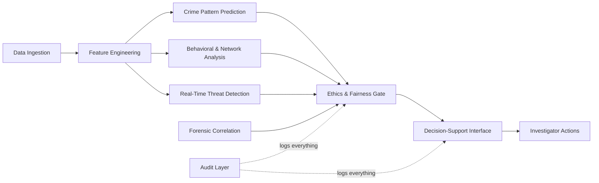

# 🔒 AI Crime Intelligence Platform

> **AI-augmented decision-support for law enforcement** — predicting where and when crimes are likely, not who will commit them.

[]()
[]()
[]()

---

## Overview

A government-grade AI platform that transforms disparate crime data into actionable intelligence for investigators — while remaining **auditable, ethically constrained, and legally defensible**.

### What It Does

| Capability | Description |
|---|---|
| 🗺️ **Crime Pattern Prediction** | Spatio-temporal hotspot forecasting (grid-cell level, 6–24 hr windows) |
| 🧠 **Behavioral Analysis** | Modus operandi clustering, crime-series linkage, escalation detection |
| 🕸️ **Network Intelligence** | Criminal network community detection, key-player identification |
| ⚡ **Real-Time Threat Detection** | Streaming anomaly detection with sub-5-second alert latency |
| 🔍 **Forensic Correlation** | Cross-case similarity, timeline reconstruction, evidence linking |
| 📊 **Decision-Support Interface** | Investigator dashboards with explainable, confidence-scored insights |

### What It Does NOT Do

- ❌ Predict **who** will commit a crime
- ❌ Use facial recognition
- ❌ Trigger autonomous actions (arrests, searches)
- ❌ Score individuals for "criminal tendency"
- ❌ Analyze communication content
- ❌ Retrain models without human approval

---

## Architecture



**Three pipelines**, one platform:

| Pipeline | Latency | Use Case |
|---|---|---|
| **Batch** | Minutes–hours | Hotspot prediction, model training |
| **Real-Time** | < 5 seconds | Streaming anomaly detection, live alerts |
| **Forensic** | Seconds–minutes | Cross-case similarity, timeline reconstruction |

**Key technologies**: Kafka, Flink, PostgreSQL + TimescaleDB, Neo4j, Redis, Elasticsearch, PyTorch, scikit-learn, MLflow, React + D3.js + Leaflet, Kubernetes

---

## Project Structure

```
Crime Analysis/
├── docs/                           # Phase design documents
│   ├── phase-00-implementation-blueprint.md
│   ├── phase-01-system-architecture.md
│   ├── phase-02-data-ecosystem-governance.md
│   ├── phase-03-ethical-legal-safety.md
│   ├── phase-04-feature-engineering.md
│   ├── phase-05-crime-pattern-prediction.md
│   ├── phase-06-behavioral-network-analysis.md
│   ├── phase-07-real-time-pipeline.md
│   ├── phase-08-forensic-correlation.md
│   ├── phase-09-decision-support-interface.md
│   ├── phase-10-mlops-governance.md
│   ├── phase-11-security-threat-modeling.md
│   ├── phase-12-testing-validation.md
│   ├── phase-13-pilot-deployment.md
│   ├── phase-14-scale-handover.md
│   ├── walkthrough.md
│   └── task-tracker.md
├── src/                            # Source code (upcoming)
│   ├── ingestion/                  # Data ingestion pipelines
│   ├── features/                   # Feature engineering
│   ├── models/                     # ML models
│   ├── ethics/                     # Bias detection & fairness gates
│   ├── streaming/                  # Real-time pipeline
│   ├── forensics/                  # Forensic correlation engine
│   ├── api/                        # Backend API
│   └── dashboard/                  # Investigator UI
├── tests/                          # Test suites
├── config/                         # Configuration files
├── scripts/                        # Utility scripts
└── README.md
```

---

## Phase Documentation

| Phase | Document | Status |
|---|---|---|
| 0 | [Master Implementation Blueprint](docs/phase-00-implementation-blueprint.md) | ✅ Complete |
| 1 | [System Architecture](docs/phase-01-system-architecture.md) | ✅ Complete |
| 2 | [Data Ecosystem & Governance](docs/phase-02-data-ecosystem-governance.md) | ✅ Complete |
| 3 | [Ethical & Legal Safety Layer](docs/phase-03-ethical-legal-safety.md) | ✅ Complete |
| 4 | [Feature Engineering](docs/phase-04-feature-engineering.md) | ✅ Complete |
| 5 | [Crime Pattern Prediction](docs/phase-05-crime-pattern-prediction.md) | ✅ Complete |
| 6 | [Behavioral & Network Analysis](docs/phase-06-behavioral-network-analysis.md) | ✅ Complete |
| 7 | [Real-Time Pipeline](docs/phase-07-real-time-pipeline.md) | ✅ Complete |
| 8 | [Forensic Correlation](docs/phase-08-forensic-correlation.md) | ✅ Complete |
| 9 | [Decision-Support Interface](docs/phase-09-decision-support-interface.md) | ✅ Complete |
| 10 | [MLOps & Model Governance](docs/phase-10-mlops-governance.md) | ✅ Complete |
| 11 | [Security & Threat Modeling](docs/phase-11-security-threat-modeling.md) | ✅ Complete |
| 12 | [Testing & Validation](docs/phase-12-testing-validation.md) | ✅ Complete |
| 13 | [Pilot Deployment](docs/phase-13-pilot-deployment.md) | ✅ Complete |
| 14 | [Scale & Handover](docs/phase-14-scale-handover.md) | ✅ Complete |

---

## Ethical Principles (Hard-Enforced)

1. **Non-discrimination** — Fairness metrics block biased outputs
2. **Transparency** — Every output carries an explainability payload
3. **Human authority** — No output triggers action without human approval
4. **Accountability** — Every prediction traceable to model, data, and engineer
5. **Fail-safe** — On uncertainty, the system alerts a human; it never acts autonomously

---

## Success Metrics

| Category | Metric | Target |
|---|---|---|
| Prediction | Hotspot precision | ≥ 70% |
| Fairness | Geographic disparity ratio | ≤ 3.0 |
| Latency | Real-time alerts (p95) | < 5 seconds |
| Availability | Uptime | 99.9% |
| Adoption | Investigator satisfaction | ≥ 4/5 |

---

## License & Classification

This project is designed for **government use**. All data handling follows GDPR-aligned data protection regulations. AI outputs are labeled as **"investigative aids, not evidence"**.

---

*Built with responsible AI principles. Designed for investigators, not autonomous policing.*
