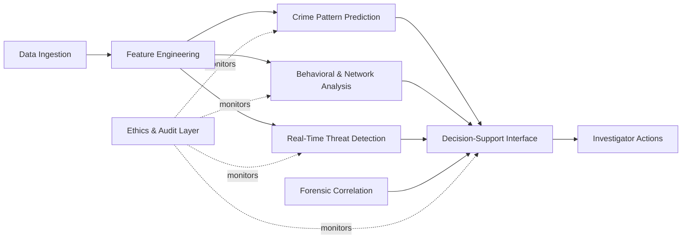
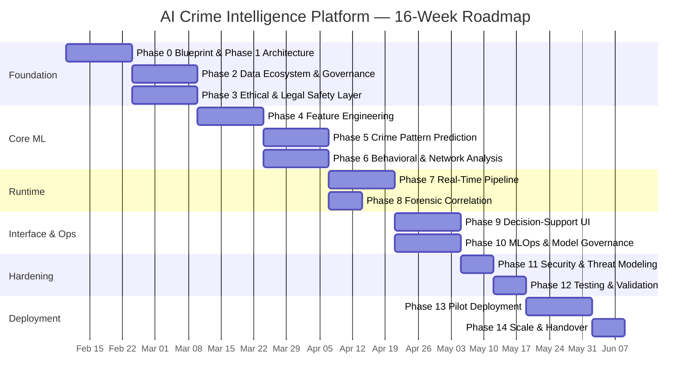
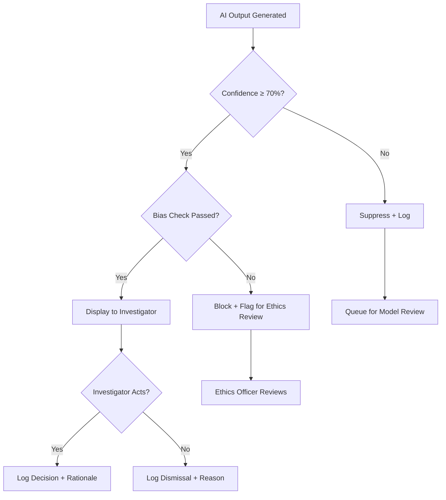

# PHASE 0 — MASTER IMPLEMENTATION BLUEPRINT
## AI-Driven Criminal Intelligence Platform

---

## 1. System Vision

An **AI-augmented decision-support platform** for law-enforcement investigators that transforms disparate crime data into actionable intelligence — while remaining **auditable, ethically constrained, and legally defensible**.

### Core Principles

| Principle | Meaning |
|---|---|
| **Decision-support, not decision-making** | The system recommends; humans decide |
| **Explain or abstain** | Every prediction must be explainable; unexplainable outputs are suppressed |
| **Bias is a defect** | Demographic disparity in model outputs is treated as a production bug |
| **Audit-first** | Every inference, access, and override is logged immutably |
| **Fail-safe** | On uncertainty the system alerts a human; it never acts autonomously |

### Capability Map

---

## 2. Functional Requirements

### FR-1: Crime Pattern Prediction
- Spatio-temporal hotspot forecasting (grid-cell level, 6–24 hr windows)
- Trend analysis (weekly/monthly crime-type trajectories)
- Seasonal and event-driven spike detection

### FR-2: Behavioral Analysis
- Modus-operandi clustering across cases
- Repeat-offender behavioral signature matching
- Crime-series linkage via behavioral similarity

### FR-3: Network Intelligence
- Co-occurrence graph construction from incident co-participation
- Community detection within criminal networks
- Influence/centrality scoring of nodes

### FR-4: Real-Time Threat Detection
- Streaming anomaly detection on live sensor/alert feeds
- Prioritized alert queue with confidence scores
- Geofence-triggered event correlation

### FR-5: Forensic Correlation
- Cross-case evidence similarity (MO, location, timing, artifacts)
- Automated timeline reconstruction from multi-source events
- Investigator-facing inference trails

### FR-6: Decision-Support Interface
- Interactive heatmaps with confidence bands
- "Why this insight?" explainability panels
- Case-level dashboards for investigators
- Audit-trail viewer for oversight officers

### FR-7: Ethical Safeguards
- Pre-inference bias checks on input data
- Post-inference fairness metrics on outputs
- Automatic suppression of low-confidence or high-bias predictions
- Red-flag alerts when model behavior drifts

---

## 3. Non-Functional Requirements

| Category | Requirement | Target |
|---|---|---|
| **Latency** | Real-time alert pipeline end-to-end | < 5 seconds |
| **Latency** | Batch prediction refresh | < 30 minutes |
| **Throughput** | Streaming events processed | ≥ 10,000 events/sec |
| **Availability** | Platform uptime | 99.9% (8.7 hr downtime/yr) |
| **Scalability** | Horizontal scale for inference | Auto-scale 1→50 nodes |
| **Data retention** | Raw crime records | Per jurisdictional policy (default 7 yr) |
| **Data retention** | Model inference logs | 5 years minimum (audit) |
| **Security** | Encryption at rest & in transit | AES-256 / TLS 1.3 |
| **Security** | Authentication | MFA + role-based access (RBAC) |
| **Compliance** | Data privacy | GDPR-aligned + local DP laws |
| **Auditability** | Every model inference | Logged with input hash, output, confidence, timestamp |
| **Explainability** | Prediction outputs | SHAP/LIME scores attached to every prediction |

---

## 4. Explicit Exclusions (What the System Will NOT Do)

> [!CAUTION]
> These exclusions are **non-negotiable** and exist to prevent misuse, illegality, and ethical violations.

| # | Exclusion | Rationale |
|---|---|---|
| 1 | **No individual crime prediction** ("who will commit a crime") | Pre-crime profiling is illegal and unethical |
| 2 | **No autonomous arrest/action triggers** | System is advisory only; human authorization required |
| 3 | **No facial recognition** | High bias risk and increasing legal bans |
| 4 | **No communication content analysis** | Wiretap laws; only metadata (CDR) is in scope |
| 5 | **No social media scraping of private accounts** | Privacy violations |
| 6 | **No predictive scoring of individuals** | Risk of discriminatory profiling |
| 7 | **No automated sentencing or bail recommendations** | Outside scope; judicial domain |
| 8 | **No direct integration with weapons systems** | Lethal autonomy is excluded |
| 9 | **No unsupervised model retraining** | All retraining requires human approval |

---

## 5. Timeline — 16-Week Execution Plan

### Week-by-Week Breakdown

| Weeks | Phase(s) | Key Deliverables |
|---|---|---|
| 1–2 | 0 + 1 | Blueprint finalized, architecture diagrams, trust boundaries |
| 3–4 | 2 + 3 | Data schemas, access-control matrix, ethics pipeline spec |
| 5–6 | 4 | Feature taxonomy, freshness rules, leakage prevention |
| 7–8 | 5 + 6 | Prediction models trained, graph ML pipeline, risk scoring |
| 9–10 | 7 + 8 | Streaming pipeline, forensic correlation engine |
| 11–12 | 9 + 10 | Investigator UI, MLOps governance, drift detection |
| 13 | 11 | Threat matrix, red-team exercises |
| 14 | 12 | Full test suite execution, go/no-go report |
| 15–16 | 13 + 14 | Shadow-mode pilot, metrics collection, handover docs |

---

## 6. Roles & Responsibilities

| Role | Count | Responsibilities |
|---|---|---|
| **ML Engineer (Lead)** | 1 | Model design, training, calibration, fairness tuning |
| **ML Engineer** | 2 | Feature engineering, model experimentation, evaluation |
| **Backend Engineer** | 2 | Data pipelines, API layer, streaming infrastructure |
| **Frontend / UI Engineer** | 1 | Decision-support interface, dashboards, UX for investigators |
| **Data Engineer** | 1 | ETL, data lake, schema management, data quality |
| **Security Engineer** | 1 | Zero-trust implementation, threat modeling, pen testing |
| **Ethics & Compliance Officer** | 1 | Bias audits, legal compliance, policy enforcement |
| **MLOps Engineer** | 1 | CI/CD for models, monitoring, drift detection, rollback |
| **Project Manager** | 1 | Sprint coordination, stakeholder comms, risk tracking |
| **Domain SME (Law Enforcement)** | 1 | Requirements validation, workflow mapping, pilot oversight |

### RACI Matrix (Key Activities)

| Activity | ML Lead | Backend | Security | Ethics | PM |
|---|---|---|---|---|---|
| Model design | **R/A** | C | I | C | I |
| Data pipeline | C | **R/A** | C | I | I |
| Bias audit | C | I | I | **R/A** | I |
| Threat modeling | I | C | **R/A** | C | I |
| Pilot deployment | C | **R** | C | C | **A** |

*R = Responsible, A = Accountable, C = Consulted, I = Informed*

---

## 7. Risk Register

### Technical Risks

| ID | Risk | Likelihood | Impact | Mitigation |
|---|---|---|---|---|
| T1 | Data quality is poor (missing fields, inconsistent formats) | High | High | Schema validation at ingestion; quarantine malformed records; data quality dashboard |
| T2 | Model accuracy insufficient for real-world use | Medium | High | Ensemble approaches; calibration; staged rollout with shadow mode |
| T3 | Streaming pipeline fails under load | Medium | High | Load testing at 10× expected volume; auto-scaling; circuit breakers |
| T4 | Feature leakage introduces bias or inflated metrics | Medium | High | Temporal split validation; feature audit pipeline; leakage detection tests |
| T5 | Model drift post-deployment | High | Medium | Automated drift detection (PSI, KS-test); scheduled retraining windows |

### Ethical Risks

| ID | Risk | Likelihood | Impact | Mitigation |
|---|---|---|---|---|
| E1 | Geographic bias amplifies over-policing in certain areas | High | Critical | Demographic parity constraints; geographic fairness metrics; human review for hotspot outputs |
| E2 | Historical data encodes systemic discrimination | High | Critical | Bias audit on training data; counterfactual fairness testing; regular third-party audits |
| E3 | System used for individual profiling despite exclusions | Medium | Critical | Hard-coded exclusions in code; access logs for every query; anomaly detection on query patterns |
| E4 | Low-confidence predictions treated as facts | Medium | High | Mandatory confidence scores on all outputs; UI enforces "uncertain" labels; red-band thresholds |

### Legal Risks

| ID | Risk | Likelihood | Impact | Mitigation |
|---|---|---|---|---|
| L1 | Non-compliance with data protection laws | Medium | Critical | Legal review per jurisdiction; data minimization; retention policies enforced automatically |
| L2 | Unauthorized data sharing between agencies | Low | Critical | Trust boundaries enforced at API level; audit logs; data-sharing agreements on file |
| L3 | Evidence contamination from AI outputs | Medium | High | AI outputs explicitly labeled "investigative aid, not evidence"; training for officers |

### Operational Risks

| ID | Risk | Likelihood | Impact | Mitigation |
|---|---|---|---|---|
| O1 | Investigators distrust or ignore the system | Medium | High | Co-design with officers; iterative UX testing; clear "why" explanations |
| O2 | Insufficient training for end-users | Medium | Medium | Mandatory training program; in-app guidance; helpdesk |
| O3 | Over-reliance on AI recommendations | Medium | High | UI friction for high-stakes actions; mandatory manual confirmation steps |

---

## 8. Success Metrics

### Model Performance

| Metric | Target | Measurement |
|---|---|---|
| Hotspot prediction precision | ≥ 70% | Weekly evaluation against actual incident reports |
| Hotspot prediction recall | ≥ 60% | Fraction of actual hotspots captured |
| False-positive rate (alerts) | ≤ 15% | Human-reviewed alert audit |
| Alert-to-action conversion | ≥ 30% | Fraction of alerts leading to investigator action |
| Behavioral linkage accuracy | ≥ 65% | Validated against known case series |

### Fairness Metrics

| Metric | Target | Measurement |
|---|---|---|
| Demographic parity gap | ≤ 5% | Across racial/ethnic/geographic groups |
| Error rate parity | ≤ 10% | False-positive rates uniform across groups |
| Prediction suppression rate | Monitored | % of outputs blocked by ethics layer |

### Operational Metrics

| Metric | Target | Measurement |
|---|---|---|
| Real-time alert latency | < 5 sec | p95 end-to-end |
| System uptime | 99.9% | Monthly SLA report |
| Mean time to insight | < 10 min | From event to investigator notification |
| User satisfaction (investigators) | ≥ 4/5 | Quarterly survey |
| Audit query response time | < 2 sec | Audit dashboard p95 |

---

## 9. Human-in-the-Loop Boundaries

> [!IMPORTANT]
> The system **MUST** defer to humans in the following scenarios. Automation stops; a qualified human decides.

### Automation Boundary Table

| System Action | Automated? | Human Gate |
|---|---|---|
| Generate crime hotspot prediction | ✅ Yes | Officer reviews before patrol dispatch |
| Flag behavioral similarity between cases | ✅ Yes | Investigator confirms linkage |
| Raise real-time threat alert | ✅ Yes | Duty officer triages priority |
| Suggest suspect network connections | ✅ Yes | Analyst validates before adding to case |
| Suppress biased prediction | ✅ Yes (auto-block) | Ethics officer reviews suppression log |
| Retrain model on new data | ❌ No | ML Lead approves dataset + triggers training |
| Deploy updated model to production | ❌ No | ML Lead + PM sign-off required |
| Share data with external agency | ❌ No | Legal officer + Superintendent approval |
| Override ethics layer suppression | ❌ No | Ethics Committee review required |
| Act on any AI output (arrest, search) | ❌ Never | Always requires officer judgment + legal authority |

### Escalation Tiers

---

## 10. Subsystem-to-Phase Mapping

| Deployable Subsystem | Primary Phase | Dependencies |
|---|---|---|
| Data Ingestion & Lake | Phase 2 | Phase 1 (architecture) |
| Ethics Enforcement Engine | Phase 3 | Phase 2 (data schema) |
| Feature Store | Phase 4 | Phase 2 |
| Hotspot Prediction Service | Phase 5 | Phase 4 |
| Network Analysis Service | Phase 6 | Phase 4 |
| Streaming Alert Pipeline | Phase 7 | Phase 5, Phase 6 |
| Forensic Correlation Engine | Phase 8 | Phase 4, Phase 6 |
| Investigator Dashboard | Phase 9 | Phases 5–8 |
| Model Registry & MLOps | Phase 10 | Phase 5, Phase 6 |
| Security Hardening | Phase 11 | All phases |
| Test Harness | Phase 12 | All phases |

---

## 11. Verification Plan

Since Phase 0 is a **documentation-only** phase, verification is review-based:

### Review Checklist
- [ ] System vision aligns with government deployment constraints
- [ ] Every functional requirement maps to a specific phase
- [ ] Exclusions list reviewed by stakeholder for completeness
- [ ] Timeline is feasible within team capacity
- [ ] Risk register covers all three domains (technical, ethical, legal)
- [ ] Success metrics have measurable, unambiguous targets
- [ ] Human-in-the-loop boundaries are exhaustive for critical actions

### Approval Gate
Phase 1 (Architecture) work begins **only** after this blueprint is approved.
