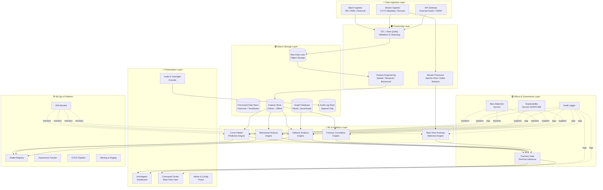
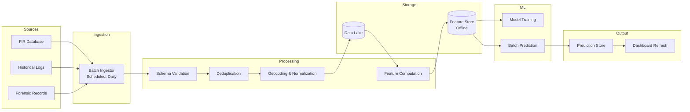
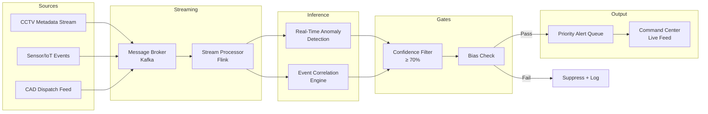
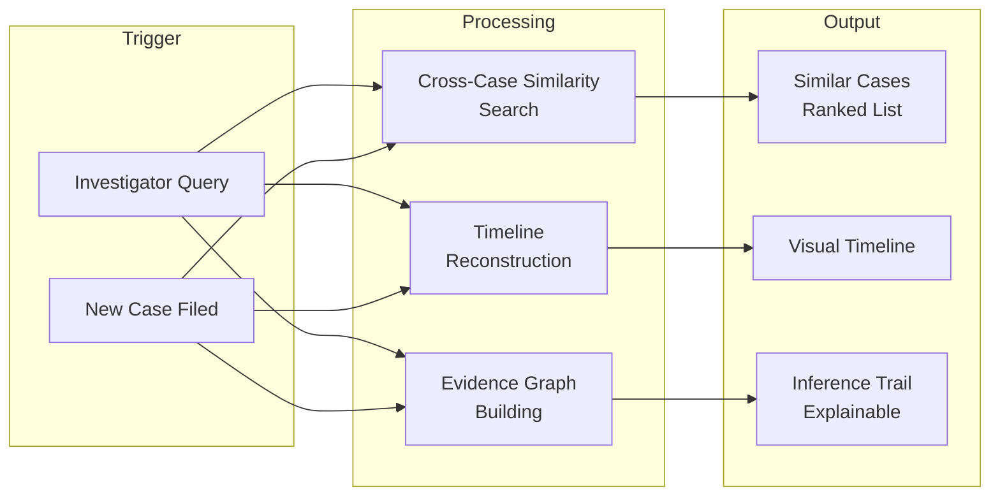
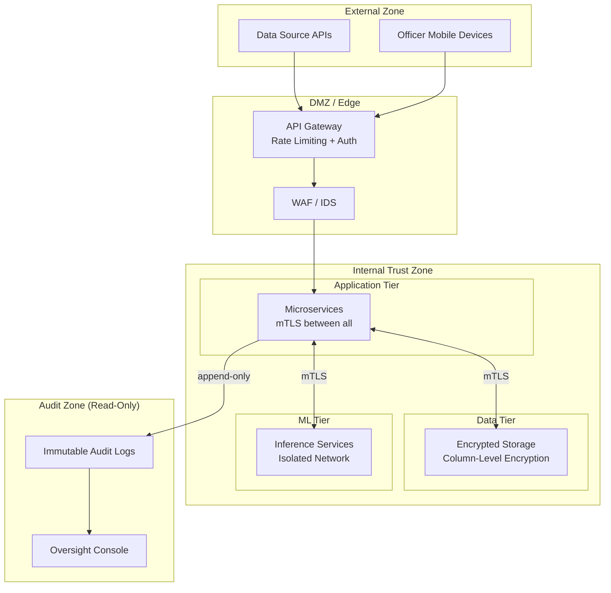
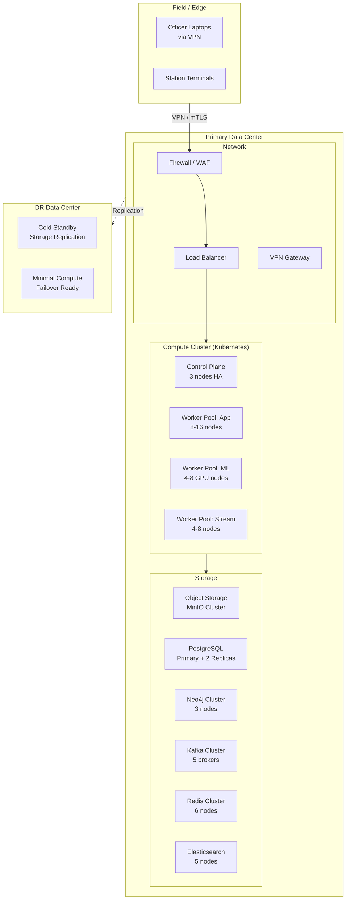
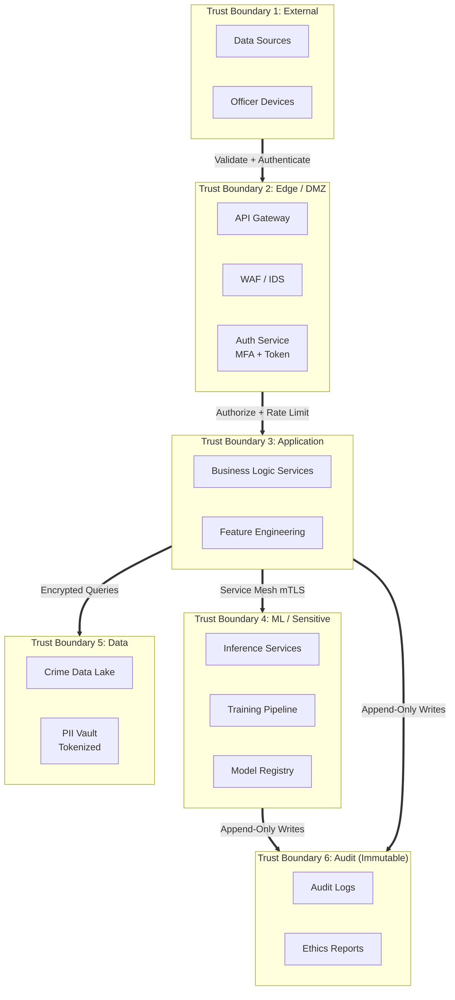

# PHASE 1 — SYSTEM ARCHITECTURE
## AI-Driven Criminal Intelligence Platform

---

## 1. Objective

Design the **complete logical and physical architecture** of the platform — defining every major component, data flow path, pipeline type, security posture, and deployment topology — before any code is written.

### Inputs
- Phase 0 Blueprint (system vision, requirements, exclusions, success metrics)
- Government infrastructure constraints (air-gapped or VPN-only networks, on-premise preference)
- Data source inventory (FIR, CCTV metadata, CDR, OSINT, forensic artifacts)

### Outputs
- Logical architecture diagram
- Physical deployment topology
- Data flow specification
- Trust boundary map
- Technology selection rationale

---

## 2. Logical Architecture

### High-Level Component Diagram

### Component Summary

| Component | Purpose | Technology Candidates |
|---|---|---|
| **Batch Ingestor** | Load FIR/RMS records, historical crime logs | Apache Spark, dbt, custom ETL |
| **Stream Ingestor** | Consume CCTV metadata, sensor events | Apache Kafka, Apache Pulsar |
| **API Gateway** | Authenticate & route external data feeds | Kong, AWS API Gateway, custom |
| **Raw Data Lake** | Store unprocessed data immutably | MinIO (on-prem S3), HDFS |
| **Processed Data Store** | Queryable, cleaned crime data | PostgreSQL + TimescaleDB |
| **Graph Database** | Criminal network relationships | Neo4j, JanusGraph |
| **Feature Store** | Online (low-latency) + Offline (batch) features | Feast, custom Redis + Parquet |
| **Stream Processor** | Real-time event processing | Apache Flink, Kafka Streams |
| **Crime Pattern Engine** | Hotspot prediction, time-series forecasting | Python, sklearn, Prophet, ST-ResNet |
| **Behavioral Engine** | MO clustering, sequence analysis | Python, HDBSCAN, HMM |
| **Network Engine** | Graph ML, community detection | Python, DGL/PyG, NetworkX |
| **Forensic Engine** | Cross-case matching, timeline building | Elasticsearch, custom |
| **Real-Time Anomaly** | Streaming anomaly detection | Isolation Forest (online), autoencoders |
| **Bias Detection** | Fairness metric computation | AIF360, Fairlearn |
| **Explainability** | Feature attribution | SHAP, LIME |
| **Investigator Dashboard** | Primary UI for officers | React, D3.js, Leaflet/Mapbox |
| **Model Registry** | Version & track models | MLflow |
| **Drift Monitor** | Detect data & concept drift | Evidently AI, custom |

---

## 3. Data Flow Specification

### 3.1 Batch Analytics Pipeline

- **Cadence**: Daily for training data refresh; predictions regenerated every 6 hours
- **SLA**: End-to-end batch ≤ 30 minutes
- **Failure mode**: Stale predictions served (last successful run) + alert to ops

### 3.2 Real-Time Pipeline

- **Latency budget**: Source → Alert ≤ 5 seconds (p95)
- **Throughput**: 10,000+ events/second sustained
- **Failure mode**: Queue backpressure → alert ops; never drop events silently

### 3.3 Forensic Intelligence Pipeline

- **Trigger**: On-demand (investigator) or event-driven (new FIR)
- **SLA**: Results within 60 seconds for investigator queries
- **No real-time constraint**: Quality > speed

---

## 4. Pipeline Separation Rationale

| Dimension | Batch | Real-Time | Forensic |
|---|---|---|---|
| **Trigger** | Scheduled (cron) | Event-driven (stream) | On-demand / event |
| **Latency** | Minutes–hours | Seconds | Seconds–minutes |
| **Data volume** | Full historical corpus | Current event window | Case-specific subset |
| **Failure tolerance** | Retry; serve stale | Alert; never drop | Retry; inform user |
| **Primary consumers** | Prediction store, dashboard | Command center, patrol | Investigators |
| **Scaling strategy** | Vertical (larger Spark jobs) | Horizontal (Flink parallelism) | Query-level (Elasticsearch) |

> [!NOTE]
> The three pipelines share a **common feature store** and **common ethics layer** to ensure consistency. A prediction made in batch uses the same fairness gates as a real-time alert.

---

## 5. Zero-Trust Security Posture

### Principles

1. **Never trust, always verify** — every request authenticated and authorized regardless of network location
2. **Least privilege** — every service, user, and process gets minimum necessary permissions
3. **Assume breach** — design as if the perimeter has already been compromised
4. **Encrypt everything** — at rest (AES-256), in transit (mTLS), in processing (secure enclaves where feasible)

### Implementation

### Access Control Matrix

| Role | Data Lake | Feature Store | ML Models | Predictions | Audit Logs | Admin |
|---|---|---|---|---|---|---|
| Investigator | ❌ | ❌ | ❌ | 🔍 Read | ❌ | ❌ |
| Analyst | 🔍 Read | 🔍 Read | ❌ | 🔍 Read | ❌ | ❌ |
| ML Engineer | 🔍 Read | ✏️ Write | ✏️ Write | 🔍 Read | 🔍 Read | ❌ |
| Data Engineer | ✏️ Write | ✏️ Write | ❌ | ❌ | 🔍 Read | ❌ |
| Ethics Officer | 🔍 Read | 🔍 Read | 🔍 Read | 🔍 Read | 🔍 Read | ❌ |
| Security Admin | ❌ | ❌ | ❌ | ❌ | 🔍 Read | ✏️ Full |
| System Admin | ⚙️ Ops | ⚙️ Ops | ⚙️ Ops | ⚙️ Ops | 🔍 Read | ✏️ Full |

---

## 6. Physical Deployment Topology

### Primary: On-Premise Government Data Center

### Resource Estimation (Pilot Scale)

| Resource | Specification | Count |
|---|---|---|
| App worker nodes | 16 vCPU, 64 GB RAM | 8 |
| ML worker nodes | 16 vCPU, 64 GB RAM, 1× A100 GPU | 4 |
| Stream worker nodes | 16 vCPU, 32 GB RAM | 4 |
| Object storage | 50 TB usable | 1 cluster |
| PostgreSQL | 32 vCPU, 128 GB RAM, 2 TB SSD | 3 (1P + 2R) |
| Kafka brokers | 8 vCPU, 32 GB RAM, 1 TB SSD | 5 |
| Neo4j | 16 vCPU, 64 GB RAM, 500 GB SSD | 3 |

---

## 7. Trust Boundaries

### Boundary Crossing Rules

| From → To | Auth Required | Encryption | Logging | Rate Limited |
|---|---|---|---|---|
| External → DMZ | MFA + API Key | TLS 1.3 | Full | Yes |
| DMZ → Application | Service token (JWT) | mTLS | Full | Yes |
| Application → ML | Service mesh identity | mTLS | Full | No |
| Application → Data | Service mesh identity | mTLS + column encryption | Query log | No |
| Any → Audit | Write token (append-only) | mTLS | Self-logging | No |
| Audit → External | ❌ Blocked | N/A | N/A | N/A |

---

## 8. Technical Decisions & Rationale

| Decision | Choice | Rationale |
|---|---|---|
| **Container orchestration** | Kubernetes (on-prem) | Government prefers on-prem; K8s is cloud-agnostic |
| **Message broker** | Apache Kafka | Proven at scale; replayable log semantics for audit |
| **Stream processing** | Apache Flink | True stream processing (not micro-batch); low latency |
| **Primary RDBMS** | PostgreSQL + TimescaleDB | Open-source; time-series extension for crime temporal data |
| **Graph DB** | Neo4j | Mature; native graph storage; Cypher query language |
| **Object storage** | MinIO | S3-compatible; on-prem deployable |
| **ML framework** | PyTorch + scikit-learn | PyTorch for deep learning; sklearn for classical; large ecosystem |
| **Feature store** | Feast | Open-source; supports online (Redis) + offline (Parquet) |
| **Model registry** | MLflow | Industry standard; tracks experiments, models, metrics |
| **Search engine** | Elasticsearch | Forensic full-text search; timeline queries |
| **Frontend** | React + D3.js + Leaflet | Rich interactive maps and charts; large talent pool |
| **Service mesh** | Istio | mTLS, observability, traffic management on K8s |

---

## 9. Risks & Mitigations (Architecture-Specific)

| Risk | Impact | Mitigation |
|---|---|---|
| On-prem GPU availability limited | Delayed ML training | Pre-provision GPU nodes; use model distillation for smaller models |
| Kafka cluster failure | Real-time pipeline down | Multi-AZ brokers; Kafka MirrorMaker to DR site |
| Neo4j scaling limitations | Large graph queries slow | Partition by jurisdiction; cache frequent subgraphs |
| Network latency between DC and field | Slow dashboard loads | CDN-like edge caching for static assets; pre-computed predictions |
| Service mesh complexity | Ops overhead | Dedicated platform team; phased Istio rollout |

---

## 10. Phase 1 Deliverables Checklist

- [x] Logical architecture diagram (Section 2)
- [x] Technology selection with rationale (Section 8)
- [x] Data flow specification — batch, real-time, forensic (Section 3)
- [x] Pipeline separation rationale (Section 4)
- [x] Zero-trust security posture (Section 5)
- [x] Physical deployment topology (Section 6)
- [x] Trust boundary map (Section 7)
- [x] Architecture-specific risks (Section 9)
