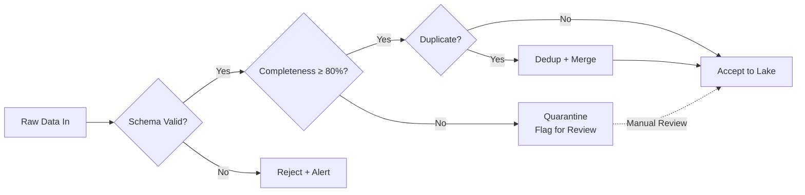

# PHASE 2 — DATA ECOSYSTEM & GOVERNANCE
## AI-Driven Criminal Intelligence Platform

---

## 1. Objective

Define **what data the system consumes, how it is structured, who controls it, and when it is destroyed**. Every downstream phase (feature engineering, ML, forensics) depends on this foundation.

### Inputs
- Phase 1 architecture (storage technologies, pipeline types)
- Jurisdictional data-protection regulations
- Agency data inventories and existing schemas

### Outputs
- Canonical data schemas (crime, actor, event, location, time)
- Data source catalog with quality grades
- Retention & deletion policies
- Access-control matrix (data-level)
- Data lineage specification

---

## 2. Data Source Inventory

| Source | Format | Refresh | Volume Estimate | Quality Grade | Sensitivity |
|---|---|---|---|---|---|
| **FIR / RMS Records** | Structured (SQL export / CSV) | Daily batch | ~500K records/year | B (some missing fields) | HIGH — PII present |
| **CAD Dispatch Logs** | Semi-structured (JSON/XML) | Near real-time | ~2M events/year | A (system-generated) | MEDIUM |
| **CCTV Metadata** | Structured stream (JSON) | Real-time | ~50M events/day | A (automated) | HIGH — location data |
| **Call Detail Records (CDR)** | Structured (CSV / Parquet) | Daily batch | ~100M records/month | A | CRITICAL — telecom regulated |
| **Historical Crime Logs** | Structured (legacy DB) | One-time + monthly | ~5M records (10yr backlog) | C (inconsistent formats) | HIGH |
| **Forensic Artifacts** | Semi-structured (PDF + JSON) | Event-driven | ~50K/year | B | CRITICAL — evidence chain |
| **Open-Source Intelligence** | Unstructured (text, geo) | Scheduled scrape | Variable | D (unverified) | LOW |
| **Weather / Events Calendar** | Structured (API) | Hourly | Small | A | LOW |
| **Census / Demographics** | Structured (CSV) | Annual | Small | A | LOW |

### Quality Grades

| Grade | Meaning | Action |
|---|---|---|
| A | System-generated, high completeness | Ingest directly |
| B | Human-entered, some gaps | Validate + impute where safe |
| C | Legacy, inconsistent formats | Transform + quarantine unknowns |
| D | Unverified external | Flag as LOW-TRUST; never sole input |

---

## 3. Canonical Data Schemas

### 3.1 Crime Event Schema (`crime_event`)

| Field | Type | Required | Description |
|---|---|---|---|
| `event_id` | UUID | ✅ | Unique identifier |
| `fir_number` | String | ❌ | First Information Report number |
| `crime_type` | Enum | ✅ | Standardized crime taxonomy code |
| `crime_subtype` | Enum | ❌ | Granular classification |
| `occurred_at` | Timestamp | ✅ | When the crime occurred (best estimate) |
| `reported_at` | Timestamp | ✅ | When reported to authorities |
| `location` | Geography | ✅ | See Location Schema |
| `status` | Enum | ✅ | `reported/investigating/closed/convicted` |
| `severity_score` | Float [0,1] | ✅ | Computed from crime type + context |
| `description` | Text | ❌ | Free-text narrative (sanitized) |
| `source_system` | String | ✅ | Originating data source |
| `ingested_at` | Timestamp | ✅ | Platform ingestion timestamp |
| `data_quality_flag` | Enum | ✅ | `clean/imputed/quarantined` |

### 3.2 Actor Schema (`actor`)

> [!WARNING]
> Actor data is **the most sensitive** in the system. All access is logged. No predictive scoring is performed on individuals.

| Field | Type | Required | Description |
|---|---|---|---|
| `actor_id` | UUID | ✅ | System-assigned (not real-world ID) |
| `actor_type` | Enum | ✅ | `suspect/victim/witness/officer` |
| `demographic_group` | Enum | ❌ | Aggregated category (for bias analysis ONLY) |
| `involvement_events` | UUID[] | ✅ | Linked `event_id` references |
| `pii_vault_ref` | Token | ✅ | Pointer to PII vault (name, address, etc.) |
| `created_at` | Timestamp | ✅ | Record creation time |
| `last_updated` | Timestamp | ✅ | Last modification time |

**PII Handling**: Real personally identifiable information (names, addresses, phone numbers) is stored in a **separate PII vault** with tokenized references. The main analytical database never contains raw PII.

### 3.3 Location Schema (`location`)

| Field | Type | Required | Description |
|---|---|---|---|
| `location_id` | UUID | ✅ | Unique identifier |
| `latitude` | Float | ✅ | WGS84 latitude |
| `longitude` | Float | ✅ | WGS84 longitude |
| `grid_cell_id` | String | ✅ | H3 hex grid cell (resolution 9, ~175m) |
| `admin_level_1` | String | ✅ | State / Province |
| `admin_level_2` | String | ✅ | District / County |
| `admin_level_3` | String | ❌ | Police station jurisdiction |
| `address_text` | String | ❌ | Human-readable address |
| `location_type` | Enum | ❌ | `residential/commercial/public/transit/other` |

### 3.4 Temporal Schema (`time_context`)

| Field | Type | Required | Description |
|---|---|---|---|
| `timestamp` | Timestamp (UTC) | ✅ | Event time |
| `local_time` | Timestamp (local TZ) | ✅ | Localized time |
| `hour_of_day` | Int [0–23] | ✅ | Derived |
| `day_of_week` | Int [0–6] | ✅ | Derived (0 = Monday) |
| `is_weekend` | Bool | ✅ | Derived |
| `is_holiday` | Bool | ✅ | From calendar source |
| `is_festival_period` | Bool | ❌ | From events calendar |
| `lunar_phase` | Enum | ❌ | Research-backed temporal factor |

### 3.5 Network Edge Schema (`network_edge`)

| Field | Type | Required | Description |
|---|---|---|---|
| `edge_id` | UUID | ✅ | Unique identifier |
| `source_actor_id` | UUID | ✅ | Actor A |
| `target_actor_id` | UUID | ✅ | Actor B |
| `relationship_type` | Enum | ✅ | `co-accused/co-located/communication/associated` |
| `evidence_events` | UUID[] | ✅ | Supporting event references |
| `confidence` | Float [0,1] | ✅ | Strength of inferred relationship |
| `first_observed` | Timestamp | ✅ | Earliest connection |
| `last_observed` | Timestamp | ✅ | Most recent connection |

---

## 4. Crime Taxonomy (Standardized)

```
CRIME_TYPE
├── VIOLENT
│   ├── HOMICIDE
│   ├── ASSAULT
│   ├── ROBBERY
│   ├── KIDNAPPING
│   └── SEXUAL_OFFENSE
├── PROPERTY
│   ├── BURGLARY
│   ├── THEFT
│   ├── VEHICLE_THEFT
│   ├── ARSON
│   └── VANDALISM
├── FINANCIAL
│   ├── FRAUD
│   ├── FORGERY
│   ├── CYBERCRIME
│   └── MONEY_LAUNDERING
├── NARCOTICS
│   ├── POSSESSION
│   ├── TRAFFICKING
│   └── MANUFACTURING
├── PUBLIC_ORDER
│   ├── RIOTING
│   ├── UNLAWFUL_ASSEMBLY
│   └── ARMS_ACT
└── OTHER
    ├── MISSING_PERSON
    ├── UNNATURAL_DEATH
    └── MISCELLANEOUS
```

---

## 5. Retention & Deletion Policies

| Data Category | Retention Period | Deletion Method | Legal Basis |
|---|---|---|---|
| Raw crime records | 10 years from case closure | Crypto-shred + physical delete | Criminal records retention law |
| Actor PII | 7 years from last involvement | Crypto-shred from PII vault | Data protection regulations |
| CCTV metadata | 90 days (unless flagged for case) | Automated purge | Surveillance policy |
| CDR metadata | 2 years | Automated purge | Telecom regulations |
| Model inference logs | 5 years | Archived then purged | Audit requirements |
| Audit trail records | 10 years | **Never deleted** (immutable) | Legal compliance |
| OSINT data | 30 days | Automated purge | Unverified, transient |
| Feature store (offline) | Aligned with source retention | Cascade delete with source | Data minimization |
| Feature store (online) | 48-hour rolling window | TTL-based eviction | Operational only |

### Deletion Process
1. Automated scheduler checks retention rules daily
2. Records past retention are flagged for deletion
3. **Crypto-shredding**: Encryption keys for the data are destroyed
4. Physical deletion follows within 72 hours
5. Deletion is logged in the immutable audit trail

---

## 6. Data Access-Control Matrix

| Role | Crime Events | Actor PII | CCTV Metadata | CDR | Network Edges | Audit Logs |
|---|---|---|---|---|---|---|
| **Investigator** | 🔍 Own jurisdiction | 🔍 Own cases only | 🔍 Flagged events | ❌ | 🔍 Own cases | ❌ |
| **Senior Investigator** | 🔍 Multi-jurisdiction | 🔍 Own cases | 🔍 Time-bounded | 🔍 With warrant ref | 🔍 Own cases | ❌ |
| **Analyst** | 🔍 Anonymized aggregates | ❌ | 🔍 Aggregated stats | ❌ | 🔍 Anonymized | ❌ |
| **ML Engineer** | 🔍 Anonymized training set | ❌ | ❌ | ❌ | 🔍 Anonymized | 🔍 Model logs only |
| **Data Engineer** | ✏️ Schema ops | ❌ | ✏️ Pipeline ops | ✏️ Pipeline ops | ✏️ Schema ops | 🔍 Pipeline logs |
| **Ethics Officer** | 🔍 Sampling for audit | 🔍 Sampling (redacted) | ❌ | ❌ | 🔍 Sampling | 🔍 Full |
| **Superintendent** | 🔍 Full (own district) | 🔍 Full (own district) | 🔍 Full | 🔍 With authorization | 🔍 Full | 🔍 Full |
| **Audit Authority** | 🔍 Full (read-only) | 🔍 Full (read-only) | 🔍 Full | 🔍 Full | 🔍 Full | 🔍 Full |

### Access Enforcement

- All data access goes through a **Policy Enforcement Point (PEP)** in the API layer
- Every query is logged: `who`, `what`, `when`, `why` (mandatory purpose field)
- Bulk data export requires **two-person authorization** (requester + approver)
- PII access triggers a **real-time notification** to the data protection officer

---

## 7. Data Lineage & Quality

### Lineage Tracking

Every data record carries:
- `source_system`: Where it originated
- `ingested_at`: When it entered the platform
- `transformations[]`: List of processing steps applied
- `data_quality_flag`: Current quality status

### Quality Gates



| Quality Dimension | Metric | Threshold | Action on Failure |
|---|---|---|---|
| Schema conformance | % records matching schema | 100% | Reject non-conforming |
| Completeness | % required fields populated | ≥ 80% | Quarantine + impute if safe |
| Timeliness | Lag from source to lake | ≤ 1 hour (batch), ≤ 10s (stream) | Alert ops team |
| Uniqueness | Duplicate record rate | ≤ 0.5% | Deduplication pipeline |
| Accuracy | Spot-check vs. source-of-truth | ≥ 95% | Monthly audit sampling |

---

## 8. Risks & Mitigations

| Risk | Impact | Mitigation |
|---|---|---|
| Data sources have incompatible schemas | Delayed feature engineering | Canonical schema with adapter layer per source |
| PII leaks into analytical database | Legal violation, trust breach | Tokenization at ingestion; PII vault separation; scan for leaks |
| CCTV metadata volume overwhelms storage | Infrastructure cost | 90-day retention + aggressive aggregation for historical |
| CDR access challenged legally | Feature set reduced | Design features to work with and without CDR |
| Historical data encodes bias | Biased models | Bias audit at data level (Phase 3); demographic balance checks |

---

## 9. Phase 2 Deliverables Checklist

- [x] Data source inventory with quality grades (Section 2)
- [x] Canonical schemas — crime, actor, location, time, network (Section 3)
- [x] Standardized crime taxonomy (Section 4)
- [x] Retention & deletion policies (Section 5)
- [x] Access-control matrix (Section 6)
- [x] Data lineage & quality gates (Section 7)
- [x] Phase-specific risks & mitigations (Section 8)
