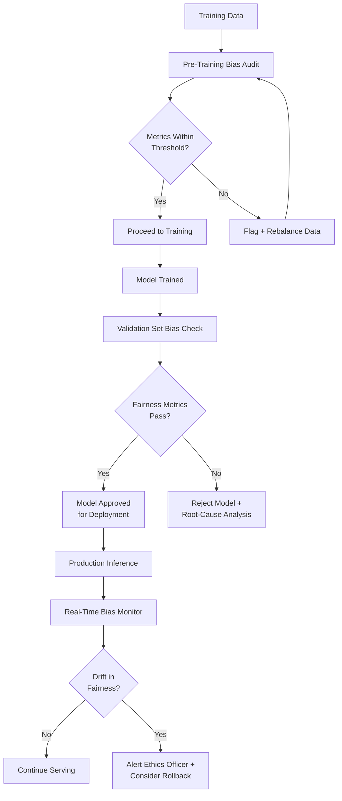
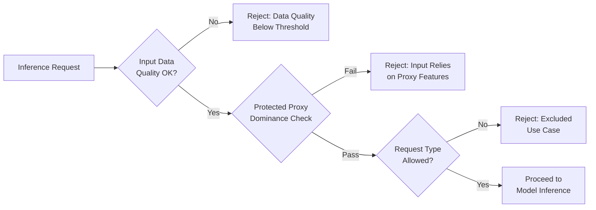
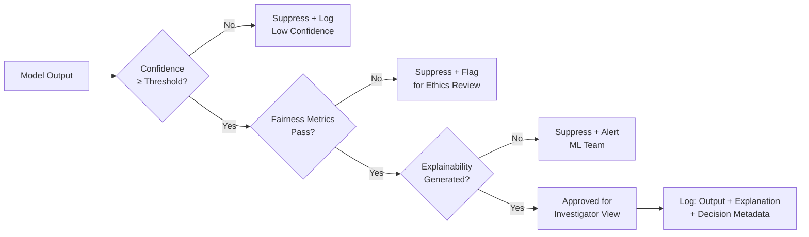

# PHASE 3 — ETHICAL & LEGAL SAFETY LAYER
## AI-Driven Criminal Intelligence Platform

---

## 1. Objective

Build a **structural guarantee layer** that prevents the system from producing illegal, biased, or unexplainable outputs. This is not a best-effort afterthought — it is a **hard enforcement mechanism** integrated into every inference path.

### Inputs
- Phase 0 exclusions list (no profiling, no facial recognition, no autonomous action)
- Phase 2 data schemas and access-control matrix
- Applicable legal frameworks (GDPR-aligned, local DP laws, criminal justice regulations)

### Outputs
- Bias detection metrics and thresholds
- Fairness constraint specifications
- Explainability requirements per model class
- Ethics enforcement pipeline (pre-inference + post-inference gates)
- Red-flag conditions that block predictions
- Audit logging specification
- Oversight dashboard specification

---

## 2. Ethical Principles (Codified)

| # | Principle | System-Level Enforcement |
|---|---|---|
| 1 | **Non-discrimination** | Fairness metrics block outputs that exceed disparity thresholds |
| 2 | **Transparency** | Every output carries an explainability payload |
| 3 | **Proportionality** | Severity of AI suggestion proportional to confidence + evidence strength |
| 4 | **Human authority** | No output triggers action without human approval |
| 5 | **Right to contest** | Individuals affected by AI-informed decisions have review path |
| 6 | **Data minimization** | System processes minimum data necessary for each task |
| 7 | **Purpose limitation** | Data used only for stated intelligence purposes, never repurposed |
| 8 | **Accountability** | Every prediction traceable to model version, data, and responsible engineer |

---

## 3. Bias Detection Framework

### 3.1 Protected Attributes

| Attribute | Source | Usage |
|---|---|---|
| Geographic area (proxy for demographics) | Location schema | Fairness analysis only |
| Crime type distribution per area | Crime events | Bias detection |
| Reporting source distribution | Data lineage | Source bias detection |
| Time-of-day / day-of-week patterns | Temporal schema | Temporal bias check |

> [!CAUTION]
> **No direct demographic attributes** (race, ethnicity, religion, caste) are used as model features. Geographic area is monitored as a **proxy** for potential demographic bias.

### 3.2 Bias Metrics

| Metric | Formula | Threshold | Applies To |
|---|---|---|---|
| **Geographic Disparity Ratio** | `max(rate_per_area) / min(rate_per_area)` | ≤ 3.0 | Hotspot predictions |
| **Prediction Parity** | `P(positive\|group=a) / P(positive\|group=b)` | 0.8 – 1.25 | All classification outputs |
| **False Positive Rate Parity** | `FPR(group=a) / FPR(group=b)` | 0.8 – 1.25 | Alert generation |
| **Calibration Across Groups** | `\|calibration_a - calibration_b\|` | ≤ 0.05 | Confidence scores |
| **Historical Amplification Score** | Trend of prediction concentration over time | Non-increasing | Hotspot evolution |

### 3.3 Bias Detection Pipeline

---

## 4. Fairness Constraints

### 4.1 Constraint Types

| Constraint | Type | Enforcement Point |
|---|---|---|
| **Demographic parity** | Group fairness | Post-inference gate |
| **Equalized odds** | Error parity | Model validation |
| **Individual fairness** | Similar inputs → similar outputs | Feature engineering |
| **Counterfactual fairness** | Would output change if protected attribute changed? | Model testing |
| **Temporal fairness** | Predictions don't amplify historical patterns | Drift monitoring |

### 4.2 Implementation Strategy

| Phase | Fairness Action |
|---|---|
| **Data preparation** | Balance geographic representation; flag under-reported areas |
| **Feature engineering** | Remove features with > 0.6 correlation to protected proxies |
| **Training** | Apply fairness-constrained optimization (e.g., adversarial debiasing) |
| **Post-processing** | Calibrate thresholds per group to equalize error rates |
| **Monitoring** | Continuous fairness dashboard; weekly automated reports |

---

## 5. Explainability Requirements

| Model Type | Explainability Method | Output | Audience |
|---|---|---|---|
| Hotspot prediction (spatial) | SHAP feature importance | Top-5 contributing factors per grid cell | Investigator |
| Time-series forecast | Decomposition (trend + seasonal + residual) | Visual decomposition chart | Analyst |
| Behavioral clustering | Cluster exemplars + distance metrics | "Similar to cases X, Y, Z because…" | Investigator |
| Network analysis | Subgraph highlighting | Visual path showing why connection inferred | Analyst |
| Anomaly detection | Anomaly score breakdown | "This event is unusual because…" | Duty Officer |

### Explainability Rules

1. **Every prediction must ship with an explanation** — predictions without explanations are suppressed
2. Explanations must be **human-readable** — no raw SHAP vectors in the UI
3. Explanations must be **faithful** — they must reflect the actual model reasoning, not a post-hoc rationalization
4. For high-stakes outputs (violent crime, organized crime hotspots), explanations must include **confidence intervals**

---

## 6. Ethics Enforcement Pipeline

### Pre-Inference Gate

### Post-Inference Gate

### Confidence Thresholds

| Output Type | Minimum Confidence | Below Threshold Action |
|---|---|---|
| Hotspot prediction | 60% | Suppress; mark area as "insufficient data" |
| Real-time threat alert | 70% | Suppress; log for batch review |
| Behavioral linkage | 65% | Show with "low confidence" tag + require analyst review |
| Network connection | 55% | Show with "speculative" tag + require analyst confirmation |
| Forensic similarity | 50% | Show ranked list; top result must be > 50% |

---

## 7. Red-Flag Conditions (Automatic Blocks)

> [!CAUTION]
> When any of these conditions are detected, the system **automatically blocks the output** and escalates to human review. No override is possible without Ethics Committee approval.

| # | Red-Flag Condition | Detection Method | Response |
|---|---|---|---|
| RF-1 | Prediction targets a specific individual | Query pattern analysis | Block + alert |
| RF-2 | Single geographic area receives > 40% of all alerts | Alert distribution monitor | Block excess + redistribute patrol |
| RF-3 | Model confidence systematically lower for certain areas | Group-wise calibration check | Block + retrain |
| RF-4 | Correlation between predictions and protected proxy > 0.6 | Feature correlation monitor | Block + audit |
| RF-5 | User queries suggest surveillance of a political/religious group | Query content classification | Block + escalate to oversight |
| RF-6 | Bulk PII export request | Access pattern monitor | Block + notify DPO |
| RF-7 | Ethics layer bypassed or disabled | System integrity monitor | Halt all inference + emergency alert |
| RF-8 | Model has not been audited in > 30 days | Audit schedule tracker | Warning → block after 45 days |

---

## 8. Audit Logging Specification

### What Is Logged

| Event Category | Fields Logged | Retention |
|---|---|---|
| **Model inference** | request_id, model_version, input_hash, output, confidence, explanation, fairness_check_result, timestamp | 5 years |
| **Data access** | user_id, role, data_scope, query, purpose, timestamp | 5 years |
| **Ethics gate decision** | gate_type, input_summary, decision (pass/block), reason, timestamp | 10 years (immutable) |
| **Model lifecycle** | model_id, action (train/deploy/rollback), actor, approval_chain, timestamp | 10 years |
| **User actions** | user_id, action, target, outcome, timestamp | 5 years |
| **Red-flag triggers** | flag_id, condition, evidence, response, resolution, timestamp | 10 years (immutable) |

### Audit Log Properties

- **Immutable**: Write-once, append-only storage (WORM compliance)
- **Tamper-evident**: Cryptographic hash chain linking consecutive entries
- **Queryable**: Full-text search + structured filters for auditors
- **Exported**: Daily encrypted backup to separate audit authority system

---

## 9. Oversight Dashboard Specification

### Dashboard: Ethics & Audit Console

| Panel | Content | Update Frequency |
|---|---|---|
| **Fairness Scorecard** | Current bias metrics for all active models | Hourly |
| **Red-Flag Event Log** | Chronological list of triggered red-flags | Real-time |
| **Prediction Suppression Rate** | % of outputs blocked by ethics gates | Hourly |
| **Geographic Distribution** | Heatmap of alert density (checking for concentration) | Hourly |
| **Model Audit Status** | Last audit date per model; countdown to mandatory audit | Daily |
| **Data Access Patterns** | Unusual access patterns flagged | Real-time |
| **Fairness Trend** | 30-day trend of bias metrics | Daily |
| **Pending Reviews** | Suppressed predictions awaiting ethics review | Real-time |

### Access
- **Ethics Officer**: Full read access to all panels
- **Audit Authority**: Full read access; can export reports
- **ML Lead**: Fairness scorecard + model audit status only
- **All others**: No access

---

## 10. Legal Compliance Mapping

| Requirement | Legal Source | Implementation |
|---|---|---|
| Lawful basis for processing | GDPR Art. 6 / Local DP law | Documented purpose limitation per data source |
| Data minimization | GDPR Art. 5(1)(c) | Only required fields ingested; PII tokenized |
| Right to erasure | GDPR Art. 17 | Crypto-shredding pipeline (Phase 2) |
| Automated decision transparency | GDPR Art. 22 | Explainability attached to every output |
| Data protection impact assessment | GDPR Art. 35 | DPIA completed before pilot (Phase 13) |
| Purpose limitation | GDPR Art. 5(1)(b) | Mandatory `purpose` field on every data access |
| Security of processing | GDPR Art. 32 | Zero-trust architecture (Phase 1, Phase 11) |
| Records of processing | GDPR Art. 30 | Audit log specification (Section 8) |

---

## 11. Risks & Mitigations

| Risk | Impact | Mitigation |
|---|---|---|
| Fairness metrics too strict → suppresses most predictions | System becomes useless | Calibrate thresholds iteratively during pilot; start permissive, tighten |
| Ethics layer adds latency to real-time pipeline | Alerts delayed beyond 5s SLA | Pre-compute fairness baselines; lightweight checks inline, heavy checks async |
| Officers bypass the system for unofficial tools | Platform loses oversight | Training program; make the platform more useful than alternatives |
| Audit log storage grows unbounded | Infra cost | Tiered storage (hot → warm → cold); 10-year cap on immutable logs |
| Third-party auditors cannot understand ML models | Audit fails | Provide model cards + plain-language explanations for every deployed model |

---

## 12. Phase 3 Deliverables Checklist

- [x] Ethical principles codified (Section 2)
- [x] Bias detection metrics and thresholds (Section 3)
- [x] Fairness constraints with implementation strategy (Section 4)
- [x] Explainability requirements per model type (Section 5)
- [x] Ethics enforcement pipeline — pre & post inference (Section 6)
- [x] Red-flag conditions with automatic blocks (Section 7)
- [x] Audit logging specification (Section 8)
- [x] Oversight dashboard specification (Section 9)
- [x] Legal compliance mapping (Section 10)
- [x] Phase-specific risks & mitigations (Section 11)
