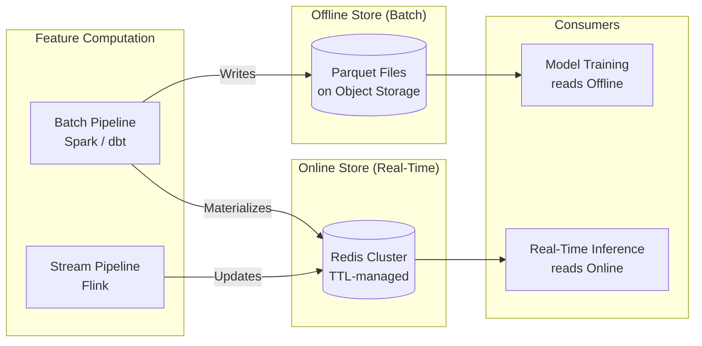
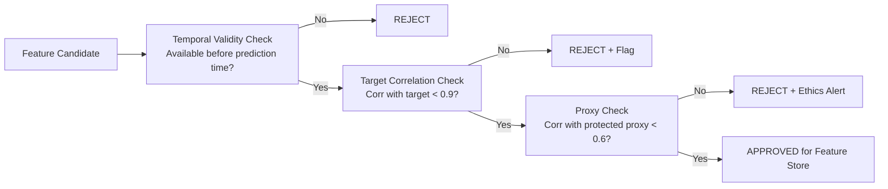
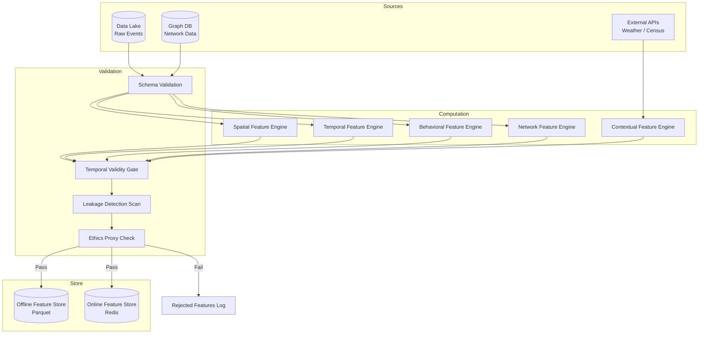

# PHASE 4 — FEATURE ENGINEERING & REPRESENTATION
## AI-Driven Criminal Intelligence Platform

---

## 1. Objective

Convert raw crime data from the data lake into **intelligence-grade ML features** — structured, validated, and free from leakage — that power all downstream prediction, behavioral analysis, and detection models.

### Inputs
- Canonical data schemas (Phase 2)
- Ethics constraints on feature usage (Phase 3)
- Model requirements from Phases 5, 6, 7

### Outputs
- Feature taxonomy (spatial, temporal, behavioral, network, contextual)
- Feature freshness rules
- Leakage prevention strategy
- Feature store design (online + offline)

---

## 2. Feature Taxonomy

### 2.1 Spatial Features

| Feature | Granularity | Computation | Use Case |
|---|---|---|---|
| `crime_count_grid_7d` | H3 cell (res 9) | Count of events per cell, 7-day rolling | Hotspot prediction |
| `crime_density_kernel` | 500m radius | Kernel density estimation | Spatial clustering |
| `distance_to_poi` | Per event | Distance to nearest police station, ATM, bar, transit | Spatial context |
| `land_use_type` | H3 cell | Residential / commercial / industrial / mixed | Baseline risk |
| `street_light_density` | H3 cell | Count from infrastructure data | Environmental factor |
| `neighboring_cell_crime` | H3 cell neighbors | Average crime in k-ring neighbors | Spatial diffusion |
| `crime_type_diversity` | H3 cell | Shannon entropy of crime types | Area characterization |

### 2.2 Temporal Features

| Feature | Granularity | Computation | Use Case |
|---|---|---|---|
| `hour_sin` / `hour_cos` | Per event | Cyclical encoding of hour | Time-of-day pattern |
| `dow_sin` / `dow_cos` | Per event | Cyclical encoding of day-of-week | Weekly pattern |
| `month_sin` / `month_cos` | Per event | Cyclical encoding of month | Seasonal pattern |
| `is_weekend` | Per event | Boolean | Weekend effect |
| `is_holiday` | Per event | Boolean from calendar | Holiday effect |
| `days_since_last_crime` | H3 cell × crime type | Gap between consecutive events | Recurrence detection |
| `crime_velocity_7d` | H3 cell | Δ(crime_count) / Δ(time) | Acceleration detection |
| `seasonal_decomposition` | District | STL decomposition trend + seasonal + residual | Long-term forecasting |

### 2.3 Behavioral Features (Modus Operandi)

| Feature | Granularity | Computation | Use Case |
|---|---|---|---|
| `mo_vector` | Per event | TF-IDF or embedding of MO description | Behavioral clustering |
| `weapon_type_encoded` | Per event | Categorical encoding | Crime signature |
| `target_type_encoded` | Per event | Categorical (person/property/vehicle/institution) | Crime signature |
| `entry_method` | Per property crime | Categorical (forced/unforced/deception) | Burglary patterns |
| `time_of_day_preference` | Per crime series | Distribution of event hours | Offender profiling |
| `location_preference` | Per crime series | Spatial center + radius | Geographic profiling |
| `escalation_score` | Per crime series | Severity trend over time | Risk assessment |

### 2.4 Network Features

| Feature | Granularity | Computation | Use Case |
|---|---|---|---|
| `degree_centrality` | Per actor node | Count of connections | Importance |
| `betweenness_centrality` | Per actor node | Bridge score between communities | Broker detection |
| `community_id` | Per actor node | Louvain / Leiden algorithm | Group identification |
| `community_size` | Per community | Node count | Network scale |
| `edge_weight` | Per edge | Count of co-occurrence events | Relationship strength |
| `temporal_activity_span` | Per actor node | Last - first seen | Network longevity |
| `2hop_neighborhood_size` | Per actor node | Nodes within 2 hops | Influence radius |

### 2.5 Contextual / External Features

| Feature | Granularity | Computation | Use Case |
|---|---|---|---|
| `temperature` | District × hour | Weather API | Environmental correlation |
| `rainfall` | District × hour | Weather API | Environmental correlation |
| `visibility_km` | District × hour | Weather API | Opportunity factor |
| `population_density` | H3 cell | Census data | Normalization |
| `unemployment_rate` | District | Economic data (quarterly) | Socioeconomic context |
| `event_proximity` | H3 cell × date | Distance/time to major event, festival | Event-driven crime |

---

## 3. Feature Freshness Rules

| Feature Class | Computation Frequency | Staleness Threshold | Fallback |
|---|---|---|---|
| **Spatial (rolling)** | Every 6 hours | 12 hours | Use last valid computation |
| **Temporal (cyclical)** | At event time | N/A (deterministic) | Always fresh |
| **Behavioral (MO)** | Daily batch | 48 hours | Use previous day's vectors |
| **Network** | Daily batch (graph rebuild) | 48 hours | Use previous graph snapshot |
| **Contextual (weather)** | Hourly | 3 hours | Use 24h-ago same-hour value |
| **Contextual (economic)** | Quarterly | 6 months | Use previous quarter |

### Feature Store Architecture

---

## 4. Leakage Prevention Strategy

> [!WARNING]
> Feature leakage is one of the most dangerous failure modes in crime prediction. It produces artificially high validation metrics but catastrophic real-world performance.

### Types of Leakage and Prevention

| Leakage Type | Example | Prevention |
|---|---|---|
| **Temporal leakage** | Using future crime counts to predict current hotspots | Strict temporal splits: train on `t-n` to `t-1`, test on `t` |
| **Target leakage** | Including arrest outcome in prediction features | Automated feature audit: no feature may correlate > 0.9 with target |
| **Label leakage** | Case status (convicted) leaking into training data | Separate label pipeline; labels computed independently |
| **Spatial leakage** | Train/test split includes nearby grid cells | Spatial block cross-validation (contiguous blocks in test set) |
| **Feedback loop leakage** | More police → more reports → higher crime count → more police | Monitor prediction-deployment-outcome loop; decorrelate patrol data from features |

### Validation Protocol

1. **Temporal Split**: Always walk-forward validation — never random split for time-series data
2. **Spatial Blocking**: Test sets use contiguous geographic blocks excluded from training
3. **Feature Audit**: Automated check that no feature uses data from after the prediction timestamp
4. **Backtesting**: Retrospective predictions on historical data compared to actual outcomes
5. **Feedback Loop Monitor**: Track correlation between model-driven patrol increases and subsequent crime reports

---

## 5. Feature Engineering Pipeline

---

## 6. Risks & Mitigations

| Risk | Impact | Mitigation |
|---|---|---|
| Feature computation latency exceeds freshness SLA | Stale features degrade prediction | Pre-aggregated materialized views; incremental computation |
| MO text embeddings carry bias | Biased behavioral analysis | Regularly audit embedding space for demographic clustering |
| Weather API downtime | Missing contextual features | Fallback to historical same-hour values; graceful degradation |
| Feature store inconsistency (online ≠ offline) | Training-serving skew | Automated consistency checks; log-and-compare pipeline |
| Too many features → overfitting | Poor generalization | Feature importance ranking; L1 regularization; periodic pruning |

---

## 7. Phase 4 Deliverables Checklist

- [x] Feature taxonomy — spatial, temporal, behavioral, network, contextual (Section 2)
- [x] Feature freshness rules (Section 3)
- [x] Feature store architecture (Section 3)
- [x] Leakage prevention strategy with validation protocol (Section 4)
- [x] Feature engineering pipeline design (Section 5)
- [x] Phase-specific risks & mitigations (Section 6)
