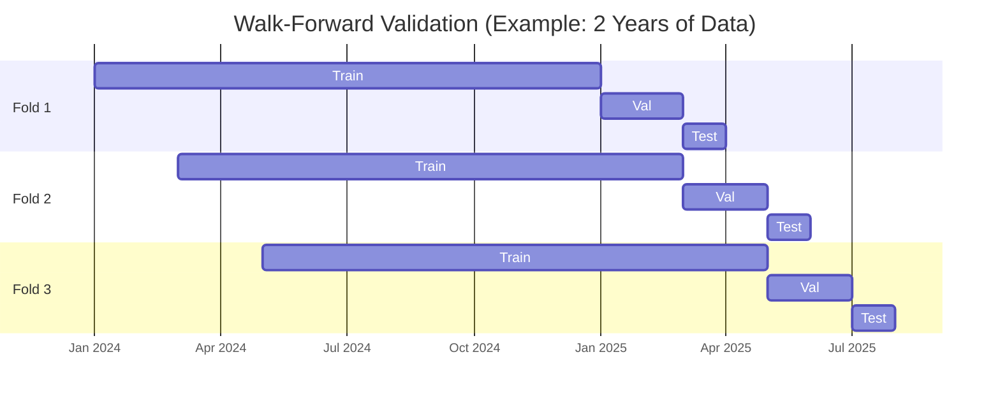
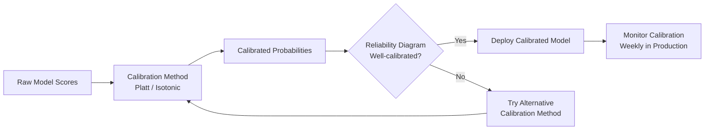

# PHASE 5 — CRIME PATTERN PREDICTION MODELS
## AI-Driven Criminal Intelligence Platform

---

## 1. Objective

Predict **where and when crimes are likely to occur** — not who will commit them. The models must be calibrated, explainable, and constrained by the ethics layer defined in Phase 3.

### Inputs
- Feature store (Phase 4): spatial, temporal, contextual features
- Ethics enforcement pipeline (Phase 3): bias checks, confidence thresholds
- Success metrics (Phase 0): precision ≥ 70%, recall ≥ 60%, FP rate ≤ 15%

### Outputs
- Model selection with rationale
- Training & evaluation strategy
- Confidence calibration approach
- Error cost analysis
- Deployment specification

---

## 2. Problem Formulation

### 2.1 Prediction Tasks

| Task | Input | Output | Granularity | Horizon |
|---|---|---|---|---|
| **Hotspot Classification** | Grid-cell features at time `t` | P(crime in cell in next 6h/12h/24h) | H3 cell (res 9, ~175m) | 6, 12, 24 hours |
| **Crime Type Forecast** | Area features + historical counts | Expected count per crime type | District | Next 7 days |
| **Spike Detection** | Time-series of crime counts | Binary: spike or not in next 48h | District × crime type | 48 hours |
| **Hotspot Evolution** | Sequence of hotspot maps | Next hotspot map | Grid of H3 cells | 24 hours |

### 2.2 What We Are NOT Predicting

| Excluded Task | Reason |
|---|---|
| Who will commit a crime | Illegal, unethical (Phase 0 exclusion) |
| Who will be a victim | Privacy violation; insufficient signal |
| Individual recidivism | Outside scope; judicial domain |
| Crime severity of specific future events | Speculative; not actionable |

---

## 3. Model Selection & Rationale

### 3.1 Model Portfolio

| Task | Primary Model | Fallback Model | Rationale |
|---|---|---|---|
| **Hotspot Classification** | Gradient Boosted Trees (XGBoost/LightGBM) | Logistic Regression | GBTs handle tabular features well; LR as interpretable baseline |
| **Crime Type Forecast** | Prophet + ARIMAX | LSTM (if sufficient data) | Prophet handles seasonality + holidays natively; ARIMAX for exogenous vars |
| **Spike Detection** | Isolation Forest + CUSUM | Statistical thresholding (Z-score) | Ensemble of anomaly detection + change-point detection |
| **Hotspot Evolution** | ConvLSTM / ST-ResNet | Persistence model (last observed map) | Deep spatio-temporal models capture diffusion; persistence as sanity baseline |

### 3.2 Selection Criteria

| Criterion | Weight | GBT | Deep Learning | Statistical |
|---|---|---|---|---|
| Predictive accuracy | 25% | ⭐⭐⭐⭐ | ⭐⭐⭐⭐⭐ | ⭐⭐⭐ |
| Explainability | 25% | ⭐⭐⭐⭐ | ⭐⭐ | ⭐⭐⭐⭐⭐ |
| Data efficiency | 20% | ⭐⭐⭐⭐ | ⭐⭐ | ⭐⭐⭐⭐ |
| Training speed | 15% | ⭐⭐⭐⭐ | ⭐⭐ | ⭐⭐⭐⭐⭐ |
| Government auditability | 15% | ⭐⭐⭐⭐ | ⭐⭐ | ⭐⭐⭐⭐⭐ |

> [!IMPORTANT]
> **Deep learning models (ConvLSTM/ST-ResNet) are used ONLY for the hotspot evolution task** where spatial diffusion patterns genuinely require them. For all other tasks, interpretable models are preferred because **auditability outweighs marginal accuracy gains**.

### 3.3 Baseline Models (Mandatory)

Every model must outperform these baselines to be deployed:

| Baseline | Method | Purpose |
|---|---|---|
| **Persistence** | Predict same pattern as last period | Minimum bar for temporal models |
| **Historical average** | Average crime rate per cell/district | Minimum bar for spatial models |
| **Random (stratified)** | Proportional random prediction | Sanity check |

---

## 4. Training & Evaluation Strategy

### 4.1 Data Splits

- **Temporal split only** — no random shuffling
- **Spatial blocking** in test set — contiguous geographic regions held out
- **Minimum 3 walk-forward folds** for reliable estimation
- **Gap period** (1 day) between train and test to prevent information leakage

### 4.2 Evaluation Metrics

| Metric | Target | Use |
|---|---|---|
| **Precision@k** (top-k hotspot cells) | ≥ 70% | Primary: how many predicted hotspots are real |
| **Recall@k** | ≥ 60% | How many real hotspots are captured |
| **PAI (Predictive Accuracy Index)** | > 1.5 | Area-normalized accuracy |
| **F1-Score** | ≥ 0.65 | Balanced precision-recall |
| **AUC-ROC** | ≥ 0.80 | Overall discrimination ability |
| **Brier Score** | ≤ 0.15 | Calibration quality |
| **MAPE** (for count forecasts) | ≤ 25% | Forecast accuracy |
| **Fairness metrics** (Phase 3) | Within thresholds | Mandatory gate |

### 4.3 Hyperparameter Optimization

| Method | Tool | Budget |
|---|---|---|
| Bayesian optimization | Optuna | 200 trials per model |
| Cross-validation | Walk-forward (3 folds) | Per trial |
| Early stopping | Validation loss patience = 10 | Per trial |

---

## 5. Confidence Calibration Strategy

### 5.1 Why Calibration Matters

A model that says "80% probability of crime in cell X" must be correct approximately 80% of the time — not 50% or 95%. **Miscalibration is dangerous**: overconfident predictions waste patrol resources; underconfident predictions hide real threats.

### 5.2 Calibration Methods

| Method | Application | When |
|---|---|---|
| **Platt Scaling** | Binary classifiers (hotspot yes/no) | Post-training calibration |
| **Isotonic Regression** | Any classifier with enough data | Post-training calibration |
| **Temperature Scaling** | Deep learning outputs | Post-training calibration |
| **Conformal Prediction** | All models: generate prediction sets with coverage guarantees | Production inference |

### 5.3 Calibration Validation

- **Reliability diagram**: Plot predicted probability vs. observed frequency; should follow diagonal
- **Expected Calibration Error (ECE)**: Target ≤ 0.05
- **Production monitoring**: Weekly recalibration check; alert if ECE exceeds 0.10

---

## 6. Error Cost Analysis

### 6.1 Asymmetric Cost Matrix

| | Predicted: Hotspot | Predicted: Not Hotspot |
|---|---|---|
| **Actual: Crime Occurred** | ✅ True Positive (benefit: resource deployed) | ❌ False Negative (cost: missed crime) |
| **Actual: No Crime** | ⚠️ False Positive (cost: wasted patrol) | ✅ True Negative (no cost) |

### 6.2 Cost Quantification

| Error Type | Direct Cost | Indirect Cost | Severity |
|---|---|---|---|
| **False Negative** (missed hotspot) | Crime occurs without preparedness | Public trust erosion; potential harm | **HIGH** |
| **False Positive** (false alarm) | Patrol deployed unnecessarily | Officer fatigue; resource waste | **MEDIUM** |
| **Biased prediction** | Legal liability; discrimination | Institutional credibility loss | **CRITICAL** |
| **Uncalibrated confidence** | Wrong prioritization of alerts | Misallocation of resources | **HIGH** |

### 6.3 Cost-Sensitive Threshold Setting

| Crime Category | FP:FN Cost Ratio | Threshold Setting |
|---|---|---|
| Violent crime (homicide, assault) | 1:5 (FN 5× more costly) | Lower threshold → favor recall |
| Property crime (burglary, theft) | 1:2 | Balanced threshold |
| Public order | 1:1 | Standard threshold |
| Narcotics | 1:2 | Moderate, but subject to bias review |

> [!NOTE]
> Thresholds are adjusted per crime category to reflect the **asymmetric real-world cost of errors**. Violent crime predictions err on the side of caution (more alerts, fewer misses).

---

## 7. Model Deployment Specification

### 7.1 Serving Architecture

| Model | Serving Mode | Refresh Cadence | Latency SLA |
|---|---|---|---|
| Hotspot Classification | Batch prediction → prediction store | Every 6 hours | N/A (pre-computed) |
| Crime Type Forecast | Batch prediction → prediction store | Daily | N/A (pre-computed) |
| Spike Detection | Streaming inference | Continuous | ≤ 5 seconds |
| Hotspot Evolution | Batch prediction → prediction store | Every 12 hours | N/A (pre-computed) |

### 7.2 Model Card Template (Required per Model)

| Section | Content |
|---|---|
| **Model name & version** | Unique identifier |
| **Task description** | What does this model predict? |
| **Training data** | Date range, source, size, quality grade |
| **Features used** | Complete list from feature taxonomy |
| **Evaluation results** | All metrics from Section 4.2 |
| **Fairness results** | All metrics from Phase 3 |
| **Calibration results** | ECE, reliability diagram |
| **Known limitations** | Edge cases, failure modes |
| **Intended use** | Approved use cases |
| **Prohibited use** | Explicitly banned applications |
| **Last audit date** | Most recent ethics audit |
| **Responsible engineer** | Name + contact |

---

## 8. Risks & Mitigations

| Risk | Impact | Mitigation |
|---|---|---|
| Insufficient historical data for some grid cells | Poor prediction in sparse areas | Hierarchical model: borrow strength from neighboring cells and district level |
| Seasonal patterns change (e.g., post-pandemic) | Model degrades | Drift detection (Phase 10); scheduled retraining windows |
| Deep learning hotspot model is a black box | Fails audit | Use SHAP on ConvLSTM; maintain GBT as explainable fallback |
| Crime reporting bias in training data | Amplifies over-policing | Historical amplification score (Phase 3); data rebalancing |
| Threshold optimization overfits to evaluation period | Poor generalization | Validate thresholds on 3+ walk-forward folds |

---

## 9. Phase 5 Deliverables Checklist

- [x] Problem formulation with explicit exclusions (Section 2)
- [x] Model selection with rationale (Section 3)
- [x] Training & evaluation strategy with walk-forward validation (Section 4)
- [x] Confidence calibration strategy (Section 5)
- [x] Error cost analysis with cost-sensitive thresholds (Section 6)
- [x] Deployment specification with model card template (Section 7)
- [x] Phase-specific risks & mitigations (Section 8)
