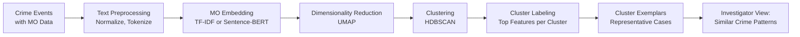
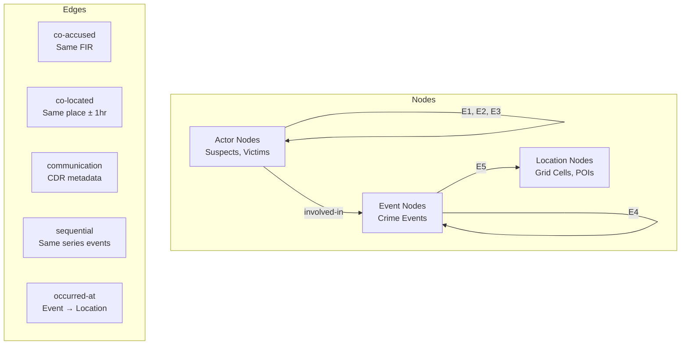
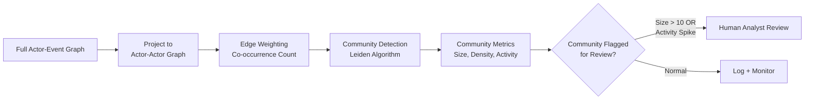

# PHASE 6 — BEHAVIORAL & NETWORK ANALYSIS
## AI-Driven Criminal Intelligence Platform

---

## 1. Objective

Analyze **criminal behavior patterns and network associations** — without targeting or scoring individuals. The system identifies **behavioral signatures, crime-series linkages, and network structures** to support investigations.

### Inputs
- Feature store (Phase 4): behavioral (MO) features, network features
- Ethics constraints (Phase 3): no individual profiling, human-review triggers
- Graph database (Phase 1): Neo4j with actor-event-location graph

### Outputs
- Behavioral analysis model designs
- Network inference logic
- Risk scoring boundaries
- Human-review trigger definitions
- Crime-series linkage methodology

---

## 2. Behavioral Analysis

### 2.1 Tasks

| Task | Input | Output | Method |
|---|---|---|---|
| **MO Clustering** | MO feature vectors per crime event | Cluster assignments + exemplars | HDBSCAN |
| **Crime-Series Linkage** | Pairs of crime events | P(same series) | Siamese network / similarity model |
| **Behavioral Sequencing** | Ordered events attributed to a series | Next-action probability distribution | Hidden Markov Model / Seq2Seq |
| **Escalation Detection** | Time-ordered events in a series | Binary: escalating or stable | Trend analysis + classification |

### 2.2 MO Clustering Pipeline

**Why HDBSCAN?**
- Does not require pre-specifying number of clusters (critical: we don't know how many MO patterns exist)
- Identifies noise points (crimes that don't fit any pattern)
- Handles varying density (some MOs are common, others rare)
- Produces a hierarchy for multi-granularity exploration

### 2.3 Crime-Series Linkage

**Problem**: Given two crime events, determine if they belong to the same crime series (committed by the same offender/group).

**Approach**: Pairwise similarity scoring with human confirmation.

| Feature Pair Comparison | Method |
|---|---|
| MO similarity | Cosine similarity of MO embeddings |
| Spatial proximity | Haversine distance; same grid cell bonus |
| Temporal proximity | Time gap (log-scaled) |
| Crime type match | Exact match / hierarchical match |
| Target type match | Same victim profile type |
| Time-of-day similarity | Circular distance |
| Weapon match | Exact match |

**Model**: Gradient Boosted classifier on pairwise feature vectors
- Train on known linked cases (ground truth from solved investigations)
- Calibrate with Platt scaling
- **Output**: Similarity score [0, 1] + explanation of top contributing factors

> [!IMPORTANT]
> Crime-series linkage **never identifies individuals**. It links **events** (cases) that share behavioral patterns. Investigator confirmation is **mandatory** before a linkage is added to a case file.

### 2.4 Escalation Detection

| Signal | Measurement | Threshold |
|---|---|---|
| Severity trend | Linear regression slope on severity scores | Positive slope, p < 0.05 |
| Frequency acceleration | Decreasing inter-event intervals | 3+ consecutive shorter gaps |
| Target escalation | Shift from property → personal → violent | Any category upgrade |
| Geographic expansion | Increasing convex hull area | > 50% expansion in 30 days |

**Action**: Escalation detected → Flag for **priority investigator review** with trend visualization.

---

## 3. Network Analysis

### 3.1 Graph Construction

### 3.2 Network Intelligence Tasks

| Task | Method | Output | Use Case |
|---|---|---|---|
| **Community Detection** | Louvain / Leiden algorithm | Group assignments | Identify criminal networks/gangs |
| **Key Player Identification** | Betweenness + PageRank centrality | Ranked node list | Find network brokers |
| **Network Evolution** | Temporal graph snapshots (monthly) | Δ in structure | Detect emerging/dissolving groups |
| **Link Prediction** | Graph Neural Network (GNN) or resource allocation index | P(future_edge) | Anticipate new associations |
| **Influence Propagation** | Independent Cascade Model | Spread probability | Understand information/activity flow |

### 3.3 Community Detection Pipeline

### 3.4 Graph ML Models

| Model | Architecture | Task | Training Data |
|---|---|---|---|
| **Link Prediction GNN** | GraphSAGE (2-layer, mean aggregator) | Predict future edges | Historical graph snapshots (t vs t+1) |
| **Node Classification** | GCN (Graph Convolutional Network) | Classify node roles (broker/peripheral/leader) | Labeled nodes from solved cases |

**Why GraphSAGE for Link Prediction?**
- Inductive: can handle new nodes without retraining
- Scalable: neighborhood sampling works for large graphs
- Produces node embeddings reusable for other downstream tasks

---

## 4. Risk Scoring Boundaries

> [!CAUTION]
> Risk scoring applies to **network structures and behavioral patterns**, NEVER to individuals. The system scores **situations**, not **people**.

### 4.1 What Is Scored

| Entity Scored | Score Represents | Range | Example |
|---|---|---|---|
| Area × Time Window | Crime likelihood | [0, 1] | "This area has 0.7 probability of burglary in next 12h" |
| Crime Series | Escalation risk | [0, 1] | "This series shows 0.8 escalation trend" |
| Network Community | Activity level change | [0, 1] | "This network's activity increased by 0.6 from baseline" |
| Case Pair | Similarity | [0, 1] | "These two cases are 0.75 similar in MO" |

### 4.2 What Is NEVER Scored

| ❌ Never Scored | Reason |
|---|---|
| Individual person's "danger level" | Illegal profiling |
| Probability that a person will commit a crime | Pre-crime, illegal |
| Person's "criminal tendency" | Discriminatory |
| Neighborhood "safety grade" | Can become discriminatory housing/insurance tool |

### 4.3 Score Thresholds and Actions

| Score Range | Label | UI Presentation | Required Action |
|---|---|---|---|
| 0.0 – 0.3 | Low | Gray indicator | Log only |
| 0.3 – 0.6 | Moderate | Yellow indicator | Include in daily briefing |
| 0.6 – 0.8 | High | Orange indicator | Flag for analyst review |
| 0.8 – 1.0 | Critical | Red indicator | **Mandatory human review within 1 hour** |

---

## 5. Human-Review Triggers

| # | Trigger Condition | Who Reviews | SLA |
|---|---|---|---|
| 1 | Crime-series linkage confidence ≥ 0.6 | Investigator assigned to either case | 24 hours |
| 2 | New community detected with > 5 members | Crime analyst | 48 hours |
| 3 | Network community shows activity spike > 2σ | Senior analyst | 12 hours |
| 4 | Escalation detected in active crime series | Case investigator | 4 hours |
| 5 | Link prediction score > 0.7 for new actor connections | Analyst | 48 hours |
| 6 | Any output involving CDR network data | Authorized officer (with warrant reference) | Before viewing |
| 7 | Behavioral cluster matches pattern from different jurisdiction | Cross-jurisdictional liaison | 72 hours |

---

## 6. Explainability for Behavioral & Network Outputs

| Output Type | Explanation Method | Presented As |
|---|---|---|
| MO Cluster assignment | Top-5 TF-IDF terms + exemplar cases | "This crime is similar to cases X, Y because of: forced entry, nighttime, residential target" |
| Series linkage | Feature contribution breakdown | "Linked because: 85% MO match, same grid cell, 3-day gap, same weapon type" |
| Centrality ranking | Subgraph visualization | Interactive graph highlighting the node's connections and bridge role |
| Community detection | Community summary stats | "Group of N actors, active over M months, involved in K events of type T" |
| Escalation alert | Trend chart | Time-series of severity + frequency with trend line |

---

## 7. Risks & Mitigations

| Risk | Impact | Mitigation |
|---|---|---|
| Graph becomes too large for single-machine processing | Slow queries, stale results | Partition by jurisdiction; use distributed graph (JanusGraph) for national scale |
| False linkages between cases | Investigator wastes time | High threshold (0.6) + mandatory human confirmation |
| MO text data is sparse or inconsistent | Poor clustering | Standardized MO input form; augment with structured fields |
| Network analysis used to surveil legitimate groups | Civil rights violation | Query logging + anomaly detection on access patterns (Phase 3 red-flags) |
| GNN models difficult to explain | Fails government audit | Maintain non-GNN baselines (Jaccard, Adamic-Adar) as explainable alternatives |

---

## 8. Phase 6 Deliverables Checklist

- [x] MO clustering methodology (Section 2.2)
- [x] Crime-series linkage model design (Section 2.3)
- [x] Escalation detection logic (Section 2.4)
- [x] Network graph construction schema (Section 3.1)
- [x] Community detection and Graph ML pipelines (Sections 3.2–3.4)
- [x] Risk scoring boundaries — what is and is NOT scored (Section 4)
- [x] Human-review triggers with SLAs (Section 5)
- [x] Explainability mapping for all outputs (Section 6)
- [x] Phase-specific risks & mitigations (Section 7)
