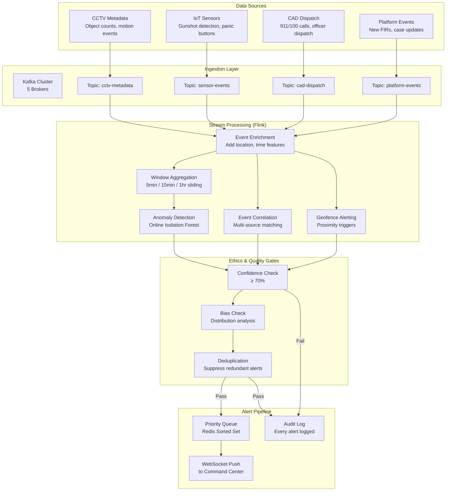
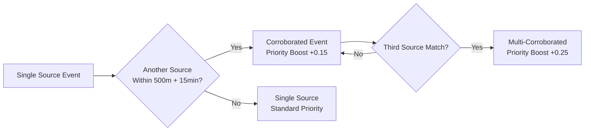

# PHASE 7 — REAL-TIME INTELLIGENCE PIPELINE
## AI-Driven Criminal Intelligence Platform

---

## 1. Objective

Detect **anomalies and threats as they happen** by processing streaming data from CCTV metadata, sensor networks, CAD dispatch systems, and alert feeds — with sub-5-second end-to-end latency.

### Inputs
- Streaming data sources (CCTV metadata, IoT sensors, CAD dispatch feeds)
- Feature store online layer (Phase 4): real-time features via Redis
- Anomaly detection models (Phase 5): spike detection, Isolation Forest
- Ethics enforcement pipeline (Phase 3): confidence thresholds, bias checks

### Outputs
- Event prioritization logic
- Alert confidence thresholds
- Latency budgets per pipeline stage
- Streaming architecture specification
- Failure & recovery modes

---

## 2. Streaming Architecture



---

## 3. Event Prioritization Logic

### 3.1 Priority Levels

| Priority | Label | Color | Response SLA | Example |
|---|---|---|---|---|
| **P0** | Critical — Imminent Threat | 🔴 Red | Immediate (< 1 min ack) | Active shooter sensor, multiple panic buttons |
| **P1** | High — Likely Incident | 🟠 Orange | < 5 minutes | Anomalous crowd surge + weapon-related CAD call |
| **P2** | Medium — Unusual Activity | 🟡 Yellow | < 30 minutes | Spike in property crimes in area |
| **P3** | Low — Informational | 🔵 Blue | Daily review | Minor deviation from baseline |

### 3.2 Priority Scoring Formula

```
priority_score = (
    0.35 × threat_severity        # Type of event (violent > property > other)
  + 0.25 × model_confidence       # ML model's confidence score
  + 0.20 × corroboration_count    # How many sources agree
  + 0.10 × temporal_urgency       # How recent (decay function)
  + 0.10 × spatial_sensitivity    # Near school, hospital, government building
)
```

| Score Range | Priority |
|---|---|
| ≥ 0.85 | P0 — Critical |
| 0.65 – 0.84 | P1 — High |
| 0.40 – 0.64 | P2 — Medium |
| < 0.40 | P3 — Low |

### 3.3 Corroboration Engine



---

## 4. Alert Confidence Thresholds

| Alert Type | Minimum Confidence | Below Threshold |
|---|---|---|
| Sensor-triggered (gunshot, panic) | N/A (hardware event) | Always alert; mark as unverified |
| ML anomaly detection | 70% | Suppress; log for batch review |
| Event correlation (multi-source) | 60% per source, 70% combined | Suppress individual; alert if combined passes |
| Geofence proximity | N/A (deterministic) | Always alert if geofence rule matches |
| Spike prediction | 65% | Show as "trend watch" not "alert" |

---

## 5. Latency Budgets

| Pipeline Stage | Budget | Measurement Point |
|---|---|---|
| Source → Kafka broker | ≤ 500ms | Producer acknowledgment |
| Kafka → Flink ingestion | ≤ 200ms | Flink source watermark |
| Event enrichment | ≤ 500ms | Feature store lookup (Redis) |
| Window aggregation | ≤ 1,000ms | Depends on window trigger |
| Anomaly detection model inference | ≤ 500ms | Model response time |
| Event correlation | ≤ 500ms | Cross-stream join |
| Ethics gate (confidence + bias) | ≤ 300ms | Gate decision |
| Alert queue → WebSocket push | ≤ 500ms | Client receipt |
| **Total End-to-End** | **≤ 5,000ms (p95)** | Source event → Command Center display |

### Latency Monitoring

- **p50, p95, p99** tracked per stage
- **Alert** if p95 > 4 seconds (80% of budget)
- **Circuit breaker** if p95 > 8 seconds: bypass enrichment, serve with reduced features

---

## 6. Windowing Strategy

| Window Type | Duration | Slide | Use Case |
|---|---|---|---|
| **Tumbling** | 5 minutes | N/A | Event counting per grid cell |
| **Sliding** | 1 hour, 15-min slide | 15 min | Rolling crime density computation |
| **Session** | 30-min gap | N/A | Group related events into incidents |
| **Global** | 24 hours, triggered | On request | Daily summary statistics |

---

## 7. Failure & Recovery Modes

| Failure Scenario | Detection | Response | Recovery |
|---|---|---|---|
| Kafka broker failure | Cluster health monitor | Remaining brokers take over (RF=3) | Auto-rebalance partitions |
| Flink job crash | Flink Job Manager | Restart from last checkpoint | Exactly-once via Kafka offsets + Flink checkpoints |
| Feature store (Redis) down | Health probe | Serve with degraded features (fewer features) | Reconnect; backfill from offline store |
| Model inference timeout | Circuit breaker pattern | Pass event through without ML score; flag as "unscored" | Auto-retry on model recovery |
| Network partition (DC split) | Heartbeat failure | Halt alerting; notify ops; serve stale | Reconnect and replay from Kafka |
| Kafka consumer lag > 60s | Lag monitoring | Scale up Flink parallelism | Auto-scale; replay backlog |
| Alert deduplication failure | Duplicate alert count spike | Temporary stricter dedup window | Log + investigate; deduplicate retroactively |

### Checkpoint & State Management

- **Flink checkpointing**: Every 30 seconds, incremental, to MinIO
- **Kafka offset management**: Consumer group offsets committed after processing
- **Exactly-once semantics**: Kafka transactions + Flink checkpointing
- **State backend**: RocksDB for large state (window aggregations)

---

## 8. Scaling Strategy

| Component | Scaling Trigger | Scale Action | Max Scale |
|---|---|---|---|
| Kafka partitions | Throughput > 80% capacity | Add partitions + brokers | 20 brokers |
| Flink parallelism | Consumer lag > 30s | Increase task slots | 128 slots |
| Redis (feature store) | Memory > 80% or latency > 10ms p95 | Add shards | 12 shards |
| WebSocket servers | Connection count > 80% capacity | Add instances | 10 instances |

---

## 9. Risks & Mitigations

| Risk | Impact | Mitigation |
|---|---|---|
| CCTV metadata volume exceeds capacity | Pipeline lag; stale alerts | Sampling strategy for low-priority cameras; aggregate at source |
| False positives flood command center | Alert fatigue | Strict confidence thresholds; deduplication; adaptive thresholds |
| Network outage to field sensors | Blind spots | Store-and-forward at sensor edge; mark areas as "no data" |
| Exactly-once semantics violated | Duplicate alerts | Idempotent alert handler; dedup key per event |
| Late-arriving events skew window results | Inaccurate aggregations | Allowed lateness in Flink (5 min); watermark strategy |

---

## 10. Phase 7 Deliverables Checklist

- [x] Streaming architecture specification (Section 2)
- [x] Event prioritization logic with scoring formula (Section 3)
- [x] Alert confidence thresholds (Section 4)
- [x] Latency budgets per pipeline stage (Section 5)
- [x] Windowing strategy (Section 6)
- [x] Failure & recovery modes (Section 7)
- [x] Scaling strategy (Section 8)
- [x] Phase-specific risks & mitigations (Section 9)
