# PHASE 8 — FORENSIC INTELLIGENCE CORRELATION
## AI-Driven Criminal Intelligence Platform

---

## 1. Objective

Assist post-incident investigations by **correlating evidence across cases, reconstructing timelines, and surfacing similar patterns** — all with explainable inference trails that investigators can follow and auditors can verify.

### Inputs
- Feature store (Phase 4): behavioral, network, spatial features
- Crime-series linkage logic (Phase 6)
- Data schemas (Phase 2): crime events, actors, locations, network edges
- Elasticsearch search engine (Phase 1)

### Outputs
- Cross-case similarity engine
- Timeline reconstruction system
- Evidence correlation methodology
- Investigator workflow mapping
- Explainable inference trails

---

## 2. Cross-Case Similarity Engine

### 2.1 Similarity Dimensions

| Dimension | Weight | Method | Data Source |
|---|---|---|---|
| **Modus Operandi** | 30% | Cosine similarity of MO embeddings | Phase 6 MO vectors |
| **Spatial Pattern** | 20% | Grid cell overlap + distance | Location schema |
| **Temporal Pattern** | 15% | Time-of-day / day-of-week similarity | Temporal schema |
| **Crime Type** | 15% | Hierarchical taxonomy match | Crime taxonomy |
| **Target Profile** | 10% | Victim/target type similarity | Event schema |
| **Forensic Artifacts** | 10% | Evidence signature matching | Forensic records |

### 2.2 Retrieval Pipeline


- **Stage 1 — Candidate Retrieval**: Approximate Nearest Neighbor (ANN) search using Elasticsearch `dense_vector` field. Fast, returns top-50 candidates.
- **Stage 2 — Re-Ranking**: Full weighted similarity computation on candidates. Produces final ranked list with per-dimension similarity breakdown.
- **Latency target**: < 30 seconds for complex queries; < 5 seconds for simple similarity lookups.

### 2.3 Output Format

For each similar case returned:

| Field | Content |
|---|---|
| `case_id` | Reference to similar case |
| `overall_similarity` | Weighted score [0, 1] |
| `dimension_scores` | Breakdown: MO (0.85), Spatial (0.72), ... |
| `common_features` | "Both: forced entry, nighttime, commercial target" |
| `differentiators` | "Case A: blunt weapon; Case B: no weapon" |
| `confidence_label` | High / Medium / Low |

---

## 3. Timeline Reconstruction

### 3.1 Multi-Source Event Merge


### 3.2 Temporal Conflict Resolution

| Conflict Type | Resolution Strategy |
|---|---|
| Two sources disagree on event time | Use source with higher reliability grade; flag uncertainty |
| Event order contradicts physics (travel time) | Flag as anomaly; highlight for investigator |
| Missing time window (gap > 2 hours) | Mark as "unaccounted period"; suggest data sources to check |
| Overlapping events at different locations | Verify actor identity; may indicate multi-actor scenario |

### 3.3 Timeline Confidence Levels

| Level | Symbol | Meaning |
|---|---|---|
| **Verified** | ✅ | Corroborated by 2+ independent sources |
| **Inferred** | 🔶 | Derived from single source or model inference |
| **Uncertain** | ❓ | Conflicting data or weak evidence |
| **Gap** | ⬜ | No data available for this period |

---

## 4. Evidence Correlation

### 4.1 Correlation Types

| Type | Description | Method |
|---|---|---|
| **Physical evidence linking** | Same weapon/tool across cases | Forensic artifact metadata matching |
| **Geographic evidence** | Same location used in multiple crimes | Spatial overlap query |
| **Temporal evidence** | Crimes clustered in time (series pattern) | Statistical clustering |
| **Behavioral evidence** | Same MO across cases | Phase 6 MO clustering |
| **Network evidence** | Shared actors/connections across cases | Graph traversal (Neo4j) |
| **Digital evidence** | CDR metadata correlation (with authorization) | Location + timing co-occurrence |

### 4.2 Evidence Graph

```mermaid
graph TB
    subgraph Case_A["Case #A-2024-001"]
        A1[Event: Burglary<br/>Jan 15, 02:00]
        A2[Location: Grid H3-X]
        A3[Evidence: Crowbar marks]
    end

    subgraph Case_B["Case #B-2024-015"]
        B1[Event: Burglary<br/>Jan 22, 03:00]
        B2[Location: Grid H3-Y<br/>Adjacent to H3-X]
        B3[Evidence: Crowbar marks]
    end

    subgraph Correlation
        C1[MO Match: 87%<br/>Forced entry, nighttime, commercial]
        C2[Spatial: Adjacent cells<br/>500m distance]
        C3[Physical: Same tool marks<br/>Pending forensic confirmation]
        C4[Temporal: 7-day gap<br/>Same weekday]
    end

    A1 & B1 --> C1
    A2 & B2 --> C2
    A3 & B3 --> C3
    A1 & B1 --> C4

    C1 & C2 & C3 & C4 --> D[Overall Correlation: 0.82<br/>HIGH — Recommend Series Linkage]
```



---

## 5. Investigator Workflow Mapping

### 5.1 Workflow: New Case Investigation

```mermaid
flowchart TB
    A[New FIR Filed] --> B[System Auto-Runs<br/>Similarity Search]
    B --> C{Similar Cases<br/>Found ≥ 0.6?}
    C -->|Yes| D[Present Top-10<br/>Similar Cases]
    C -->|No| E[No matches.<br/>Case treated as standalone]
    D --> F[Investigator Reviews<br/>Each Match]
    F --> G{Accept<br/>Linkage?}
    G -->|Yes| H[Link Cases in System<br/>Merge Timelines]
    G -->|No| I[Dismiss. Logged<br/>for Model Learning]
    H --> J[Combined Evidence<br/>Graph Generated]
    J --> K[Investigator Follows<br/>AI-Suggested Leads]
    K --> L[Every AI Suggestion<br/>Requires Human Verification]
```



### 5.2 Workflow: Cold Case Review


### 5.3 Workflow: Cross-Jurisdictional Pattern


---

## 6. Explainable Inference Trails

### 6.1 Trail Structure

Every forensic correlation output includes a **complete inference trail**:

```
INFERENCE TRAIL — Correlation ID: FC-2026-0042
═══════════════════════════════════════════════
Query Case:     #A-2024-001 (Burglary, Jan 15)
Matched Case:   #B-2024-015 (Burglary, Jan 22)
Overall Score:  0.82 (HIGH)

EVIDENCE CHAIN:
  1. MO Similarity: 0.87
     → Feature: forced_entry=True (both)
     → Feature: time_of_day=02:00-03:00 (both)
     → Feature: target_type=commercial (both)
     → Feature: weapon=crowbar (both)
     → Method: Cosine similarity of MO embedding vectors

  2. Spatial Proximity: 0.72
     → Distance: 480m (adjacent H3 cells)
     → Same admin area: District-7, Station-3

  3. Temporal Pattern: 0.65
     → Gap: 7 days (same day-of-week: Wednesday)
     → Consistent with weekly cycle pattern

  4. Forensic Match: 0.85
     → Tool marks: "similar striation pattern" (forensic report)
     → Status: PENDING lab confirmation

MODEL METADATA:
  Model version: series-linkage-v2.3.1
  Training data: 2023-01 to 2025-12
  Last audit: 2026-01-28
  SHAP top features: weapon_match(+0.22), time_similarity(+0.18),
                     spatial_distance(-0.15), mo_cosine(+0.28)

DISCLAIMER:
  This correlation is an investigative aid, NOT evidence.
  Human verification is REQUIRED before any legal action.
```

### 6.2 Trail Auditability

| Property | Implementation |
|---|---|
| **Complete** | Every step from query to output documented |
| **Reproducible** | Same input + model version = same output |
| **Timestamped** | When the correlation was generated |
| **Versioned** | Which model + data version produced it |
| **Immutable** | Stored in append-only audit log |

---

## 7. Risks & Mitigations

| Risk | Impact | Mitigation |
|---|---|---|
| Similar cases from different jurisdictions use different schemas | Poor cross-case matching | Canonical schema normalization (Phase 2) |
| Forensic artifacts not digitized | Missing evidence dimension | Graceful degradation; score without forensic dimension |
| Timeline reconstruction shows contradictory evidence | Investigator confusion | Clearly label conflicts; never resolve them automatically |
| System surfaces connections that lead to tunnel vision | Investigator fixates on AI suggestion | UI explicitly shows alternative hypotheses; "what else could explain this?" |
| CDR correlation used without proper authorization | Legal violation | Mandatory warrant reference before CDR features are included |

---

## 8. Phase 8 Deliverables Checklist

- [x] Cross-case similarity engine with multi-dimensional scoring (Section 2)
- [x] Timeline reconstruction from multi-source events (Section 3)
- [x] Evidence correlation methodology (Section 4)
- [x] Investigator workflow mapping — new case, cold case, cross-jurisdiction (Section 5)
- [x] Explainable inference trail specification (Section 6)
- [x] Phase-specific risks & mitigations (Section 7)
