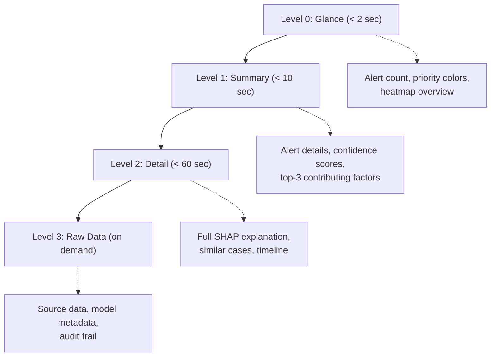

# PHASE 9 — DECISION-SUPPORT INTERFACE
## AI-Driven Criminal Intelligence Platform

---

## 1. Objective

Build an investigator-facing interface that **supports decisions without replacing judgment**. Designed for **high-stress, high-stakes environments** — clarity over decoration, speed over spectacle, trust over flash.

### Inputs
- All prediction outputs (Phases 5–8)
- Explainability payloads (Phase 3 ethics layer)
- User roles and access controls (Phase 2)
- Alert priority levels (Phase 7)

### Outputs
- UX principles for law enforcement
- Interface component specifications
- Misuse prevention UI patterns
- Information hierarchy design
- Accessibility requirements

---

## 2. UX Principles for High-Stress Environments

| # | Principle | Implementation |
|---|---|---|
| 1 | **Clarity over aesthetics** | High-contrast, minimal UI; no unnecessary animations |
| 2 | **Glanceable information** | Critical data visible in < 2 seconds without scrolling |
| 3 | **Progressive disclosure** | Summary first → details on demand → raw data if needed |
| 4 | **Explicit uncertainty** | Every AI output shows confidence level visually |
| 5 | **Non-prescriptive language** | "Elevated likelihood" not "crime will happen here" |
| 6 | **Confirmation friction** | High-stakes actions require deliberate confirmation |
| 7 | **Dark mode default** | Reduces eye strain in 24/7 command centers |
| 8 | **Offline-capable** | Core data accessible without real-time connection |
| 9 | **Keyboard-first navigation** | Faster than mouse for trained operators |
| 10 | **Multi-monitor support** | Command centers use 3–6 screens |

---

## 3. Interface Components

### 3.1 Investigator Dashboard

```
┌─────────────────────────────────────────────────────────────────┐
│  🏠 Dashboard    🗺️ Map    📊 Analytics    🔍 Search    ⚙️ Settings  │
├─────────────────────────┬───────────────────────────────────────┤
│                         │                                       │
│   CRIME HEATMAP         │   ACTIVE ALERTS              [P0: 2] │
│   ┌───────────────┐     │   ┌─────────────────────────────────┐ │
│   │               │     │   │ 🔴 P0 — Sensor trigger, Sector 7│ │
│   │   [Leaflet    │     │   │    Confidence: 89% | 2min ago   │ │
│   │    Map with   │     │   │    [View Details] [Acknowledge]  │ │
│   │    Heatmap    │     │   ├─────────────────────────────────┤ │
│   │    Overlay]   │     │   │ 🔴 P0 — Multi-source anomaly    │ │
│   │               │     │   │    Confidence: 92% | 5min ago   │ │
│   │               │     │   │    [View Details] [Acknowledge]  │ │
│   └───────────────┘     │   ├─────────────────────────────────┤ │
│                         │   │ 🟠 P1 — Crime spike detected     │ │
│   Layer Controls:       │   │    Confidence: 74% | 12min ago  │ │
│   ☑ Hotspot Prediction  │   │    [View Details]                │ │
│   ☑ Active Incidents    │   └─────────────────────────────────┘ │
│   ☐ Patrol Routes       │                                       │
│   ☐ Historical Overlay  │   TREND PANEL                         │
│                         │   ┌─────────────────────────────────┐ │
│   Time Controls:        │   │  Crime Count — Last 7 Days      │ │
│   [◄ 6h] [12h] [24h ►] │   │  📈 [Sparkline chart]           │ │
│                         │   │  ▲ +12% vs previous week        │ │
│                         │   └─────────────────────────────────┘ │
├─────────────────────────┴───────────────────────────────────────┤
│   QUICK ACTIONS:  [🔍 Search Cases] [📋 Daily Briefing] [📊 Reports] │
└─────────────────────────────────────────────────────────────────┘
```

### 3.2 Heat Map — "Why This Hotspot?" Panel

When an investigator clicks on a hotspot cell:

```
┌─────────────────────────────────────────────────┐
│  HOTSPOT DETAILS — Grid H3-7F2B3C               │
│  ─────────────────────────────────────────────── │
│                                                   │
│  Prediction: ELEVATED CRIME LIKELIHOOD            │
│  Confidence: ████████░░ 78%                       │
│  Time Window: Next 12 hours                       │
│  Crime Type: Burglary (primary), Theft (secondary)│
│                                                   │
│  ─── WHY THIS INSIGHT? ──────────────────────── │
│                                                   │
│  Top Contributing Factors:                        │
│  1. ▓▓▓▓▓▓▓▓ Historical pattern (+0.28)          │
│     "12 burglaries in this cell in last 90 days"  │
│  2. ▓▓▓▓▓▓░░ Time-of-day match (+0.22)           │
│     "Peak burglary hours approaching (01:00-04:00)"│
│  3. ▓▓▓▓▓░░░ Day-of-week pattern (+0.18)         │
│     "Wednesdays show 2.3× baseline rate here"    │
│  4. ▓▓▓▓░░░░ Recent trend (+0.10)                │
│     "3 incidents in last 7 days (↑ from 1/week)" │
│                                                   │
│  ─── IMPORTANT CONTEXT ─────────────────────── │
│  ⚠️  This is a prediction, not a certainty.       │
│  ⚠️  Confidence band: 65% – 88%                  │
│  ℹ️  Last model audit: Jan 28, 2026              │
│                                                   │
│  [View Historical Data] [View Similar Areas]      │
│  [Dismiss — Log Reason ▼]                         │
└─────────────────────────────────────────────────┘
```

### 3.3 Case Similarity Panel

```
┌─────────────────────────────────────────────────┐
│  SIMILAR CASES — To Case #A-2024-001             │
│  ─────────────────────────────────────────────── │
│                                                   │
│  1. Case #B-2024-015   Similarity: ████████░░ 82%│
│     Burglary | Jan 22 | District-7               │
│     Match: MO (87%), Location (72%), Time (65%)  │
│     [View Case] [View Inference Trail]           │
│                                                   │
│  2. Case #C-2024-008   Similarity: ██████░░░░ 64%│
│     Burglary | Jan 10 | District-7               │
│     Match: MO (71%), Time (68%), Target (55%)    │
│     [View Case] [View Inference Trail]           │
│                                                   │
│  3. Case #D-2023-312   Similarity: █████░░░░░ 51%│
│     Burglary | Dec 02 | District-9               │
│     Match: MO (62%), Forensic (45%)              │
│     [View Case] [View Inference Trail]           │
│                                                   │
│  ⚠️  These are investigative leads, not evidence. │
│     Confirm each linkage before acting.           │
│                                                   │
│  [✅ Accept Linkage] [❌ Dismiss] [🔍 Refine Search]│
└─────────────────────────────────────────────────┘
```

### 3.4 Timeline Viewer

```
┌─────────────────────────────────────────────────────────────┐
│  TIMELINE — Case #A-2024-001                                 │
│  ────────────────────────────────────────────────────────── │
│                                                               │
│  Jan 15, 01:45  ✅  CCTV: Suspicious movement detected       │
│       │              Source: Camera CAM-7B-12                 │
│  Jan 15, 01:52  🔶  CDR: Phone activity near location        │
│       │              Source: CDR metadata (Warrant #W-2024-07)│
│  Jan 15, 02:01  ✅  CAD: Break-in alarm triggered            │
│       │              Source: Alarm monitoring service          │
│  Jan 15, 02:08  ✅  CAD: Patrol dispatched                   │
│       │              Source: Dispatch system                   │
│  Jan 15, 02:15  ⬜  UNEXPLAINED GAP (7 min)                  │
│       │              "No data. Consider: exit route CCTV?"   │
│  Jan 15, 02:22  ✅  CAD: Officers arrive on scene            │
│       │              Source: Dispatch system                   │
│  Jan 15, 03:30  ✅  FIR: Report filed                        │
│       │              Source: FIR database                      │
│                                                               │
│  Legend: ✅ Verified  🔶 Inferred  ❓ Uncertain  ⬜ Gap       │
│                                                               │
│  [Export Timeline] [Add Manual Entry] [Link to Case #B-2024-015]│
└─────────────────────────────────────────────────────────────┘
```

### 3.5 Network Visualization

```
┌─────────────────────────────────────────────────┐
│  NETWORK GRAPH — Community #27                   │
│  ─────────────────────────────────────────────── │
│                                                   │
│  ┌───────────────────────────────────────┐       │
│  │                                       │       │
│  │    [A]─────[B]───[C]                  │       │
│  │     │      / \     │                  │       │
│  │     │    /     \   │                  │       │
│  │    [D]─[E]     [F]─[G]               │       │
│  │         │                             │       │
│  │        [H]    (Interactive D3.js      │       │
│  │               force-directed graph)   │       │
│  └───────────────────────────────────────┘       │
│                                                   │
│  Community Stats:                                 │
│  Nodes: 8 | Edges: 10 | Active: 6 months        │
│  Primary Crime Type: Narcotics (65%)             │
│  Activity Trend: ▲ Increasing                    │
│                                                   │
│  Key Node: [B] — Highest betweenness (0.72)      │
│  "Acts as bridge between sub-groups [A,D] and    │
│   [C,F,G]. Removing this node would fragment     │
│   the network into 2 disconnected components."   │
│                                                   │
│  ⚠️  Node labels are system IDs, not names.       │
│     PII available only at investigator's desk.    │
│                                                   │
│  [View Temporal Evolution] [Export for Report]     │
└─────────────────────────────────────────────────┘
```

---

## 4. Misuse Prevention UI Patterns

### 4.1 Language Rules

| ❌ Never Display | ✅ Instead Display |
|---|---|
| "Criminal #A1234" | "Actor ID A-1234" |
| "Predicted criminal activity" | "Elevated crime likelihood" |
| "Dangerous area" | "Area with elevated activity" |
| "Suspect profile" | "Behavioral pattern summary" |
| "100% accurate" | "Model confidence: XX%" |
| "The AI says…" | "Analysis suggests… (confidence: XX%)" |

### 4.2 Friction Patterns

| Action | Friction Level | Implementation |
|---|---|---|
| View prediction heatmap | None | Open access for role |
| View case similarity results | Low | Click to expand (progressive disclosure) |
| Accept a case linkage | Medium | Confirmation dialog + mandatory reason field |
| View PII from actor record | High | MFA re-authentication + purpose field + logged |
| Export data for external use | Very High | Two-person approval + justification + time-limited access |
| Override ethics-blocked output | Maximum | Ethics Committee ticket + justification + approval trail |

### 4.3 Dismissal Logging

When an investigator **dismisses** an AI suggestion, they must select a reason:

```
WHY ARE YOU DISMISSING THIS SUGGESTION?
○ Not relevant to my case
○ Already known information
○ Low quality / incorrect
○ Biased or unfair
○ Other: [________________]

[Submit Dismissal]
```

All dismissals are logged for model improvement feedback loops.

---

## 5. Information Hierarchy



---

## 6. Accessibility Requirements

| Requirement | Standard | Implementation |
|---|---|---|
| Color contrast | WCAG 2.1 AA (4.5:1 min) | Color palette tested with contrast checker |
| Color-blind safe | Deuteranopia, protanopia, tritanopia | Use shapes + patterns in addition to color |
| Screen reader | ARIA labels on all interactive elements | Semantic HTML + ARIA |
| Keyboard navigation | Full app operable without mouse | Tab order, focus indicators, shortcuts |
| Text scaling | Up to 200% without layout break | Responsive design, rem units |
| Locale support | Multi-language interface | i18n framework; Hindi, English, regional |

---

## 7. Technology Stack (UI)

| Component | Technology | Rationale |
|---|---|---|
| **Frontend framework** | React 18 | Component model; large ecosystem; government familiarity |
| **State management** | Zustand | Lightweight; less boilerplate than Redux for this scale |
| **Maps** | Leaflet + Leaflet.heat | Open-source; offline-capable via tile caching |
| **Charts** | D3.js + Recharts | D3 for network graphs; Recharts for standard charts |
| **Real-time updates** | WebSocket (Socket.IO) | Bi-directional for alert push |
| **Styling** | CSS Modules + design tokens | Consistent theming; dark mode support |
| **Testing** | Playwright + Jest | E2E for critical workflows; unit for components |

---

## 8. Risks & Mitigations

| Risk | Impact | Mitigation |
|---|---|---|
| Officers don't trust AI suggestions | Low adoption | Co-design with officers; show "why" for every insight; iterative usability testing |
| Information overload in command center | Critical alerts missed | Strict priority levels; audio cues for P0; alert throttling |
| Dashboard used as "surveillance tool" | Ethical violation | No individual tracking views; access logging; query anomaly detection |
| Network diagrams misinterpreted | Wrong conclusions | Mandatory training; tooltips explaining what connections mean |
| Offline mode shows stale predictions | Poor decisions | Visible "last updated: X hours ago" timestamps; stale data warnings |

---

## 9. Phase 9 Deliverables Checklist

- [x] UX principles for high-stress environments (Section 2)
- [x] Interface component specifications — dashboard, heatmap, similarity, timeline, network (Section 3)
- [x] Misuse prevention UI patterns — language, friction, dismissal logging (Section 4)
- [x] Information hierarchy design (Section 5)
- [x] Accessibility requirements (Section 6)
- [x] Technology stack selection (Section 7)
- [x] Phase-specific risks & mitigations (Section 8)
