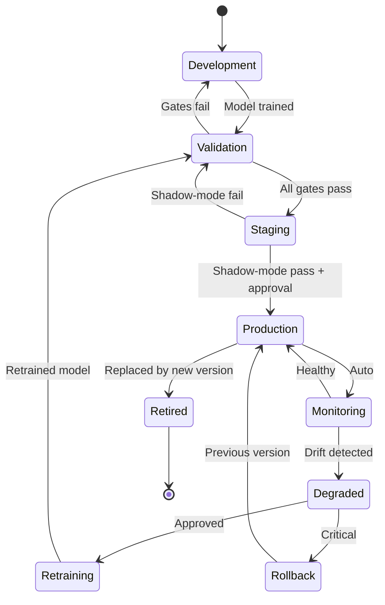
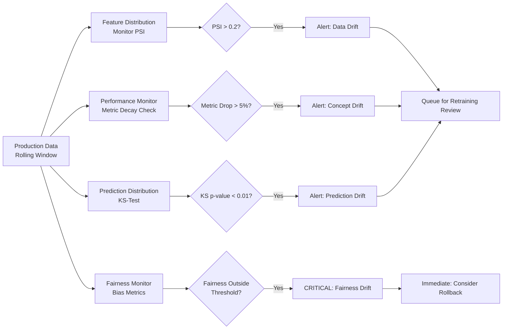
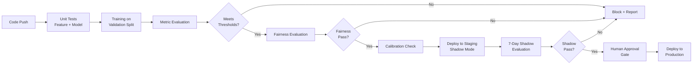

# PHASE 10 — MLOPS & MODEL GOVERNANCE
## AI-Driven Criminal Intelligence Platform

---

## 1. Objective

Control models **after deployment** — versioning, monitoring, drift detection, rollback, and incident response. Models in a crime intelligence system are not fire-and-forget; they require continuous governance.

### Inputs
- All trained models (Phases 5, 6, 7)
- Model card templates (Phase 5)
- Ethics constraints (Phase 3)
- Infrastructure (Phase 1)

### Outputs
- Model lifecycle policy
- Versioning & registry design
- Drift detection strategy
- Rollback mechanisms
- Incident response playbooks

---

## 2. Model Lifecycle Policy



### Lifecycle Stages

| Stage | Gate | Approver | Max Duration |
|---|---|---|---|
| **Development** | Code review + unit tests | Peer ML engineer | 2 weeks |
| **Validation** | Accuracy + fairness + calibration metrics | ML Lead | 3 days |
| **Staging** | 7-day shadow mode (parallel with production) | ML Lead + Ethics Officer | 7 days |
| **Production** | Sign-off by ML Lead + PM | — | Until replaced |
| **Monitoring** | Continuous automated checks | Automated | Ongoing |
| **Degraded** | Drift detected; human reviews | ML Lead | 48 hours to resolve |
| **Rollback** | Critical failure or bias spike | ML Lead (emergency) | Immediate |
| **Retired** | Replaced by validated successor | ML Lead | Archived indefinitely |

---

## 3. Model Registry (MLflow)

### Registry Schema

| Field | Description |
|---|---|
| `model_name` | Canonical name (e.g., `hotspot-classifier-v3`) |
| `version` | Semantic version (MAJOR.MINOR.PATCH) |
| `stage` | Development / Staging / Production / Retired |
| `training_data_hash` | Hash of training dataset for reproducibility |
| `training_data_range` | Date range of training data |
| `hyperparameters` | Full parameter set |
| `metrics` | All evaluation metrics (accuracy, fairness, calibration) |
| `model_card` | Link to completed model card (Phase 5 template) |
| `artifact_uri` | Path to serialized model artifact |
| `ethics_audit_date` | Last ethics review date |
| `responsible_engineer` | Owner |
| `created_at` | Training timestamp |
| `promoted_at` | When promoted to Production |

### Versioning Rules

- **MAJOR**: Architecture change or new feature set → full re-validation required
- **MINOR**: Retrained on new data with same architecture → shadow-mode required
- **PATCH**: Bug fix, threshold adjustment → fast-track validation

---

## 4. Drift Detection

### 4.1 Types of Drift

| Drift Type | What Changes | Detection Method | Severity |
|---|---|---|---|
| **Data drift** | Input feature distributions shift | Population Stability Index (PSI) | Medium |
| **Concept drift** | Relationship between features and target changes | Performance decay on recent data | High |
| **Label drift** | Crime reporting patterns change | Target distribution monitoring | Medium |
| **Prediction drift** | Model output distribution shifts | KS-test on prediction scores | Medium |
| **Fairness drift** | Bias metrics deteriorate | Fairness metric time-series | Critical |

### 4.2 Detection Pipeline



### 4.3 Monitoring Schedule

| Check | Frequency | Automated? |
|---|---|---|
| Feature distribution (PSI) | Daily | Yes |
| Performance on recent labeled data | Weekly | Yes |
| Prediction distribution (KS) | Daily | Yes |
| Fairness metrics | Daily | Yes |
| Calibration check (ECE) | Weekly | Yes |
| Full audit (model card update) | Monthly | No — human |

---

## 5. Rollback Mechanisms

### 5.1 Rollback Types

| Type | Trigger | Action | Duration |
|---|---|---|---|
| **Automatic rollback** | 2+ critical alerts in 24h | Revert to previous version | < 5 minutes |
| **Manual rollback** | ML Lead decision | Promote previous version | < 15 minutes |
| **Emergency halt** | Ethics layer breached | Stop all inference; serve no predictions | < 1 minute |

### 5.2 Rollback Procedure

```mermaid
flowchart LR
    A[Drift Alert<br/>or Incident] --> B{Severity?}
    B -->|Critical| C[Auto-Rollback<br/>to v(n-1)]
    B -->|High| D[Page ML Lead<br/>Manual Decision]
    B -->|Medium| E[Queue for<br/>Next Review]
    C --> F[Verify v(n-1)<br/>Serving Correctly]
    D --> G{Rollback?}
    G -->|Yes| C
    G -->|No| H[Document<br/>Justification]
    F --> I[Post-Incident<br/>Review in 48h]
```

### 5.3 Model Archive

- Last **3 production versions** are always deployable (warm standby)
- All historical versions archived (cold storage) for audit
- Rollback restores model artifact + threshold configuration + feature list

---

## 6. CI/CD for Models

### Pipeline Stages



---

## 7. Incident Response Playbooks

### Playbook 1: Model Performance Degradation

| Step | Action | Responsible |
|---|---|---|
| 1 | Alert triggered (metric drop > 5%) | Automated |
| 2 | Verify alert is not a data quality issue | Data Engineer (1h) |
| 3 | Check for data drift (PSI analysis) | ML Engineer (2h) |
| 4 | If data drift: evaluate retraining on recent data | ML Lead (4h) |
| 5 | If concept drift: investigate root cause | ML Lead + Domain SME (8h) |
| 6 | If critical: rollback to previous version | ML Lead (immediate) |
| 7 | Document incident in model registry | ML Engineer |
| 8 | Post-incident review within 48 hours | Full ML team |

### Playbook 2: Fairness Alert

| Step | Action | Responsible |
|---|---|---|
| 1 | Fairness metric exceeds threshold | Automated |
| 2 | **Immediately** notify Ethics Officer | Automated (page) |
| 3 | Assess impact: how many predictions affected? | ML Engineer (1h) |
| 4 | Consider rollback or emergency halt | ML Lead + Ethics Officer (2h) |
| 5 | Root-cause analysis: data? model? threshold? | ML team (24h) |
| 6 | Remediation plan approved by Ethics Committee | Ethics Officer (48h) |
| 7 | Full documentation in audit log | ML Engineer |

### Playbook 3: System Outage (No Predictions Available)

| Step | Action | Responsible |
|---|---|---|
| 1 | Health check fails for prediction service | Automated |
| 2 | Serve last cached predictions with "stale" flag | Automated |
| 3 | Page on-call ML Engineer | Automated |
| 4 | Diagnose: infra vs. model vs. data issue | On-call (30 min) |
| 5 | Restore service or escalate | On-call → ML Lead |
| 6 | Post-incident review | Full team (48h) |

---

## 8. Phase 10 Deliverables Checklist

- [x] Model lifecycle policy (Section 2)
- [x] Model registry design (Section 3)
- [x] Drift detection strategy — types, pipeline, schedule (Section 4)
- [x] Rollback mechanisms (Section 5)
- [x] CI/CD pipeline for models (Section 6)
- [x] Incident response playbooks (Section 7)
