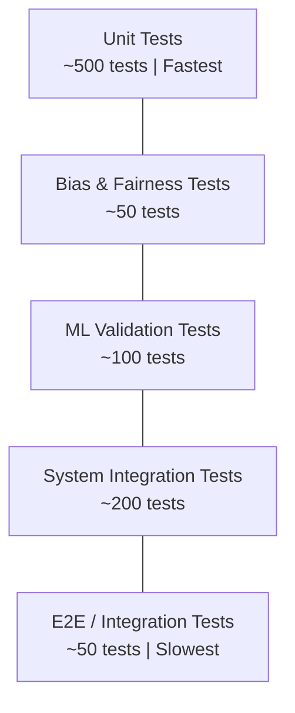

# PHASE 12 — TESTING & VALIDATION
## AI-Driven Criminal Intelligence Platform

---

## 1. Objective

Prove the system is **safe, accurate, fair, and resilient** through comprehensive testing — covering functional correctness, ML performance, bias regression, adversarial robustness, and operational resilience.

### Inputs
- All system components (Phases 1–11)
- Success metrics (Phase 0)
- Fairness thresholds (Phase 3)
- Red-team results (Phase 11)

### Outputs
- Test strategy with coverage matrix
- Test execution reports
- Go / No-Go criteria for pilot deployment

---

## 2. Test Strategy

### 2.1 Test Pyramid

### 2.2 Test Coverage Matrix

| Test Category | Scope | Count | Automation | Frequency |
|---|---|---|---|---|
| **Unit tests** | Feature engineering, data validation, API logic | ~500 | 100% automated | Every commit |
| **Bias & fairness** | All model outputs against fairness thresholds | ~50 | 100% automated | Every model build |
| **ML validation** | Accuracy, calibration, drift on held-out data | ~100 | 100% automated | Every model build |
| **Integration** | Service-to-service, pipeline end-to-end | ~200 | 90% automated | Daily |
| **E2E** | Full user workflows (investigator dashboard) | ~50 | 80% automated (Playwright) | Daily |
| **Performance** | Latency, throughput, scaling | ~30 | 100% automated | Weekly |
| **Security** | Pen testing, vulnerability scanning | ~30 | 60% automated | Weekly + pre-deploy |
| **Adversarial ML** | Evasion, poisoning, inversion attempts | ~20 | 50% automated | Monthly + pre-deploy |
| **Chaos / Resilience** | Component failure, network partition | ~15 | 70% automated | Monthly |

---

## 3. ML-Specific Tests

### 3.1 Accuracy Under Stress

| Test | Description | Pass Criteria |
|---|---|---|
| **Baseline comparison** | Every model outperforms all baselines (Phase 5) | AUC, F1, PAI all exceed baselines |
| **Temporal generalization** | Performance on 3+ walk-forward folds | Metric variance < 10% across folds |
| **Sparse data** | Performance on grid cells with < 10 historical events | Graceful degradation; no wild predictions |
| **Cold start** | Performance on brand-new areas (no history) | System returns "insufficient data" rather than guess |
| **Event surge** | Performance during 5× normal event volume | Latency within SLA; accuracy does not degrade > 5% |
| **Data quality degradation** | 10%, 20%, 30% missing features | Graceful degradation curve documented |

### 3.2 Bias Regression Tests

| Test | Description | Pass Criteria |
|---|---|---|
| **Geographic disparity** | Prediction rate ratio across areas | ≤ 3.0 (Phase 3 threshold) |
| **Prediction parity** | P(positive) ratio across groups | 0.8 – 1.25 |
| **FPR parity** | False-positive rate ratio | 0.8 – 1.25 |
| **Calibration parity** | ECE difference across groups | ≤ 0.05 |
| **Historical amplification** | Prediction concentration over time | Non-increasing trend |
| **New data bias** | Bias metrics after retraining on new data | All metrics within thresholds |

### 3.3 Adversarial Input Tests

| Test | Attack Type | Description | Pass Criteria |
|---|---|---|---|
| **Feature perturbation** | Evasion | Slight modifications to input features | Prediction change < 15% |
| **Outlier injection** | Poisoning | Inject statistical outliers into feature store | Anomaly detection flags within 1h |
| **Systematic bias injection** | Poisoning | Inject data skewed toward one area | Bias metrics alert within 24h |
| **Model query flood** | Inversion | 10,000 rapid queries with small variations | Rate limiter engages; no data leaks |

---

## 4. System Integration Tests

### 4.1 Pipeline Tests

| Test | Path | Pass Criteria |
|---|---|---|
| Batch ingestion → Data Lake → Feature Store → Prediction | Full batch pipeline | End-to-end in < 30 min |
| Event → Kafka → Flink → Alert → Dashboard | Full streaming pipeline | End-to-end in < 5 sec (p95) |
| New FIR → Similarity Search → Investigator Queue | Forensic pipeline | Results in < 30 sec |
| Ethics gate blocks biased output | Inference → Ethics → Suppression | 100% of test biased outputs blocked |
| Audit log captures all events | Any action → Audit store | 0 unlogged events in test suite |

### 4.2 Failure & Recovery Tests

| Test | Scenario | Pass Criteria |
|---|---|---|
| Kafka broker failure | Kill 1 of 5 brokers | No data loss; recovery < 30 sec |
| Feature store failure | Redis cluster down | Serve predictions with degraded features; alert fires |
| Model serving crash | Kill inference service | Auto-restart < 60 sec; serve stale predictions meanwhile |
| Database failover | Kill primary PostgreSQL | Replica promotes < 30 sec; no data loss |
| Network partition | Split Flink from Kafka | Backpressure engages; recover after heal |
| Full DC failure | Simulate DR scenario | DR site serves (degraded) within 4 hours |

---

## 5. Performance Tests

| Test | Method | Target | Tool |
|---|---|---|---|
| Streaming throughput | Generate 10,000 events/sec | Process without lag | Kafka load generator |
| API latency | 100 concurrent users, mixed queries | p95 < 500ms | k6 / Locust |
| Dashboard load time | Full page with map + charts + alerts | First meaningful paint < 2 sec | Lighthouse |
| Feature store lookup | 1,000 concurrent lookups | p95 < 10ms | Redis benchmark |
| Batch pipeline duration | Full daily run with 500K records | Complete < 30 min | Timed execution |
| Model inference latency | Single prediction request | p95 < 100ms | Custom benchmark |
| Concurrent model inference | 500 concurrent inference requests | p95 < 500ms | k6 |

---

## 6. User Acceptance Tests (UAT)

### Participants: 5–10 Investigators + 2–3 Analysts + 1 Ethics Officer

| # | Scenario | Success Criteria |
|---|---|---|
| 1 | View hotspot predictions on map | User finds relevant area within 30 sec |
| 2 | Drill into "Why this hotspot?" | User understands top factors |
| 3 | Receive and triage a P0 alert | User acknowledges within 1 min |
| 4 | Search for similar cases | User finds relevant matches; trusts results |
| 5 | View case timeline | User can follow event sequence logically |
| 6 | View network graph | User understands key connections |
| 7 | Dismiss a suggestion with reason | Dismissal logged correctly |
| 8 | Attempt to access out-of-jurisdiction data | Access denied; logged |
| 9 | Ethics officer reviews suppression log | All suppressions visible with reasons |
| 10 | Export data for report | Two-person auth enforced |

---

## 7. Go / No-Go Criteria

### Go Criteria (ALL must pass)

| # | Criterion | Threshold |
|---|---|---|
| 1 | All ML models exceed baselines on all evaluation metrics | Phase 5 targets met |
| 2 | All fairness metrics within thresholds | Phase 3 thresholds met |
| 3 | Zero critical security vulnerabilities (red-team) | 0 critical, ≤ 2 high (with mitigations) |
| 4 | Real-time pipeline latency within SLA | p95 < 5 sec |
| 5 | System availability over 7-day stress test | ≥ 99.9% |
| 6 | All incident response playbooks tested | At least 1 drill per playbook |
| 7 | UAT satisfaction | ≥ 80% of participants rate "useful" |
| 8 | Audit trail complete and tamper-proof | 100% coverage verified |
| 9 | Ethics review sign-off | Ethics Officer + Committee approval |
| 10 | Legal review complete | Legal counsel confirms compliance |

### No-Go Conditions (ANY triggers delay)

| # | Condition | Action |
|---|---|---|
| 1 | Any fairness metric outside threshold | Block until resolved + re-audited |
| 2 | Critical security vulnerability unresolved | Block until patched + re-tested |
| 3 | Real-time latency p95 > 8 sec | Performance optimization sprint |
| 4 | UAT satisfaction < 60% | UX redesign sprint |
| 5 | Ethics Officer withholds sign-off | Resolve concerns before proceeding |
| 6 | Audit trail has gaps | Fix logging; re-test |

---

## 8. Phase 12 Deliverables Checklist

- [x] Test strategy with coverage matrix (Section 2)
- [x] ML-specific tests — accuracy, bias, adversarial (Section 3)
- [x] System integration tests — pipeline + failure (Section 4)
- [x] Performance test specification (Section 5)
- [x] UAT scenarios (Section 6)
- [x] Go / No-Go criteria (Section 7)
