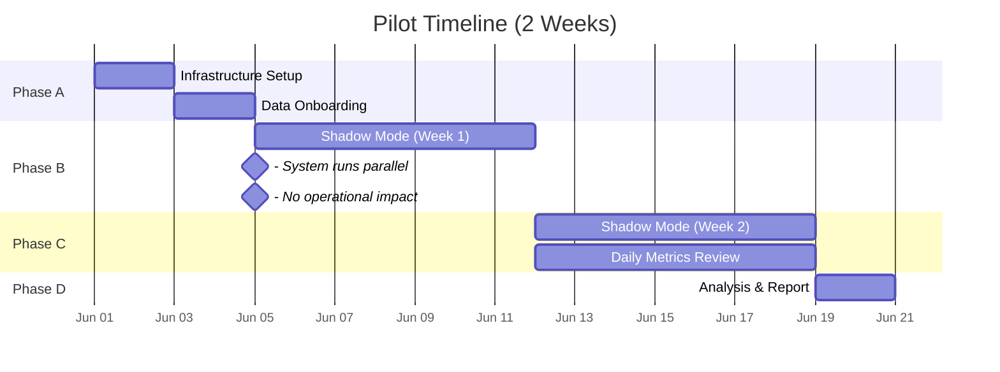
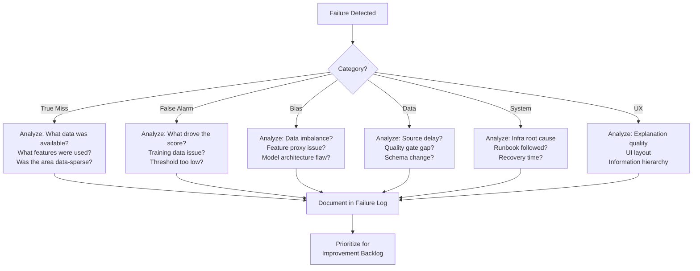

# PHASE 13 — PILOT DEPLOYMENT
## AI-Driven Criminal Intelligence Platform

---

## 1. Objective

Conduct a **limited, controlled real-world trial** of the platform in a single jurisdiction — running in **shadow mode** before any operational decisions are influenced. Collect ground-truth performance data and refine the system.

### Inputs
- All tested system components (Phases 1–12)
- Go decision from Phase 12
- Pilot jurisdiction selection criteria
- Trained end-users

### Outputs
- Pilot execution plan
- Shadow-mode metrics
- Failure analysis
- Improvement backlog
- Go / No-Go for full deployment

---

## 2. Pilot Scope

### 2.1 Selection Criteria for Pilot Jurisdiction

| Criterion | Rationale |
|---|---|
| Mid-sized city (population 500K–2M) | Large enough for meaningful data; small enough to manage |
| Digital records available (FIR, CAD) | Data infrastructure exists |
| Mix of crime types | Tests multiple model capabilities |
| Cooperative local law enforcement | Willing to participate; provide feedback |
| Not politically sensitive area | Reduce external pressure during pilot |
| Existing CCTV metadata feed | Tests real-time pipeline |

### 2.2 Pilot Phases

### 2.3 Shadow Mode Definition

> [!IMPORTANT]
> During shadow mode, the system **produces predictions but they are NOT shown to operational officers**. Only the pilot evaluation team sees outputs. This prevents the system from influencing police behavior and allows unbiased comparison of predictions against actual outcomes.

| What Happens | What Does NOT Happen |
|---|---|
| System ingests real data | No patrol decisions influenced |
| Models generate predictions | No alerts on officer screens |
| Predictions logged + compared to actual events | No operational action based on AI |
| Pilot team reviews outputs daily | No public-facing deployment |
| Ethics checks run on all outputs | No data leaves the pilot environment |

---

## 3. Pilot Metrics

### 3.1 Prediction Quality

| Metric | Measurement | Target | Comparison |
|---|---|---|---|
| Hotspot precision@50 | Top-50 predicted cells vs. actual crime locations | ≥ 60% | Baseline: historical average |
| Hotspot recall@50 | Fraction of actual hotspots in top-50 | ≥ 50% | Baseline: fixed patrol zones |
| PAI (Predictive Accuracy Index) | Area-normalized accuracy | > 1.5 | Baseline: 1.0 (random) |
| Spike detection accuracy | Predicted spikes vs. actual | ≥ 65% precision, ≥ 55% recall | Baseline: none exists |
| False positive rate | Alerts without corresponding real events | ≤ 20% | Lower is better |

### 3.2 Fairness Metrics (During Pilot)

| Metric | Target | Measurement |
|---|---|---|
| Geographic disparity ratio | ≤ 3.0 | Daily check |
| Prediction parity across areas | 0.8 – 1.25 | Daily check |
| FPR parity across areas | 0.8 – 1.25 | Daily check |
| Prediction concentration trend | Non-increasing | Weekly check |

### 3.3 Operational Metrics

| Metric | Target | Measurement |
|---|---|---|
| System uptime during pilot | ≥ 99.5% | Monitoring |
| Real-time pipeline latency | p95 < 5 sec | Continuous |
| Feature freshness compliance | ≥ 95% features within SLA | Daily check |
| Data ingestion success rate | ≥ 99% records ingested cleanly | Daily check |
| Audit log completeness | 100% events logged | Daily verification |

### 3.4 User Experience (Pilot Team Only)

| Metric | Method | Target |
|---|---|---|
| Prediction usefulness | Pilot team rates each day's predictions | ≥ 3/5 average |
| Explanation clarity | "Did you understand why?" survey | ≥ 80% yes |
| Interface usability | SUS (System Usability Scale) | ≥ 70 |
| Information overload | "Too many alerts?" feedback | < 30% say "too many" |

---

## 4. Failure Analysis Framework

### 4.1 Classification of Failures

| Category | Definition | Example |
|---|---|---|
| **True Miss** | Crime occurred but system did not predict elevated risk | Hotspot in an area with score < 0.3 |
| **False Alarm** | System predicted elevated risk but nothing happened | P1 alert with no corresponding incident |
| **Bias Failure** | Prediction systematically wrong for specific areas | One district gets 5× the alerts despite similar crime rates |
| **Data Failure** | Missing, corrupted, or delayed data caused poor prediction | Feature store had stale data from 24h ago |
| **System Failure** | Infrastructure issue affecting predictions | Real-time pipeline down for 2 hours |
| **UX Failure** | Correct prediction but pilot team couldn't understand/use it | Explanation was too technical |

### 4.2 Root-Cause Analysis Process

---

## 5. Improvement Backlog Template

| ID | Category | Description | Severity | Fix Effort | Phase Target |
|---|---|---|---|---|---|
| IMP-001 | True Miss | Sparse-area model needs hierarchical borrowing | High | Medium | Phase 5 (model update) |
| IMP-002 | UX | Factor explanations too verbose for quick scan | Medium | Low | Phase 9 (UI) |
| IMP-003 | Data | CDR feed delayed by 6 hours | High | Medium | Phase 2 (data SLA) |
| ... | ... | ... | ... | ... | ... |

---

## 6. Pilot Go / No-Go for Full Deployment

### Go Criteria

| # | Criterion | Threshold |
|---|---|---|
| 1 | Hotspot precision@50 in shadow mode | ≥ 55% (lower than prod target — it's pilot) |
| 2 | All fairness metrics within thresholds | Phase 3 thresholds |
| 3 | System uptime | ≥ 99% |
| 4 | No critical security incidents | 0 |
| 5 | Pilot team usefulness rating | ≥ 3/5 |
| 6 | All P0 improvement backlog items addressed | 100% |
| 7 | Ethics Officer sign-off on pilot results | Approved |

### No-Go Conditions

| # | Condition | Action |
|---|---|---|
| 1 | Fairness metrics outside threshold for > 3 days | Halt pilot; investigate; remediate |
| 2 | Critical security vulnerability in live environment | Halt pilot; patch; re-test |
| 3 | More than 2 system outages > 1 hour | Infra stabilization sprint |
| 4 | Pilot team rates system "harmful" or "misleading" | Full UX and model review |

---

## 7. Phase 13 Deliverables Checklist

- [x] Pilot scope and jurisdiction selection criteria (Section 2)
- [x] Shadow-mode definition and timeline (Section 2)
- [x] Pilot metrics — prediction, fairness, operational, UX (Section 3)
- [x] Failure analysis framework (Section 4)
- [x] Improvement backlog template (Section 5)
- [x] Go / No-Go criteria for full deployment (Section 6)
