# PHASE 14 — SCALE & HANDOVER
## AI-Driven Criminal Intelligence Platform

---

## 1. Objective

Prepare the platform for **national-scale usage** — from a single-jurisdiction pilot to multi-jurisdiction production — with complete documentation, training materials, and a governance handbook for sustainable operation.

### Inputs
- Pilot results and improvement backlog (Phase 13)
- All system components (Phases 1–12, refined post-pilot)
- Organizational readiness assessment

### Outputs
- Scaling strategy (single → multi-jurisdiction → national)
- Complete documentation suite
- Training materials for all user roles
- Governance handbook
- Handover checklist

---

## 2. Scaling Strategy

### 2.1 Scale Phases

```mermaid
graph LR
    A["🔬 Pilot<br/>1 Jurisdiction<br/>~50 Users"] --> B["📈 Regional<br/>4-6 Jurisdictions<br/>~300 Users"]
    B --> C["🏛️ National<br/>All Jurisdictions<br/>~5,000+ Users"]
```

| Dimension | Pilot (Current) | Regional | National |
|---|---|---|---|
| **Jurisdictions** | 1 | 4–6 | All |
| **Users** | ~50 | ~300 | 5,000+ |
| **Data volume** | ~500K events/yr | ~3M events/yr | ~50M events/yr |
| **Compute nodes** | 16 | 40–60 | 200+ |
| **GPU nodes** | 4 | 8–12 | 30+ |
| **Kafka brokers** | 5 | 10 | 20+ |
| **DB replicas** | 2 | 4 | 8+ (multi-region) |

### 2.2 Multi-Tenancy Strategy

| Approach | Description | Trade-off |
|---|---|---|
| **Data isolation** | Each jurisdiction's data in separate logical partition | Strong security; harder for cross-jurisdiction queries |
| **Shared compute** | Single Kubernetes cluster with namespace isolation | Cost-efficient; requires strong RBAC |
| **Model federation** | Base model + jurisdiction-specific fine-tuning | Better local accuracy; more operational complexity |
| **Federated feature store** | Jurisdiction-local online store, centralized offline store | Low latency; controlled data sharing |

### 2.3 Cross-Jurisdiction Intelligence

> [!IMPORTANT]
> **Raw data never leaves a jurisdiction.** Only anonymized pattern summaries and model weight updates are shared with the national hub. This preserves data sovereignty.

---

## 3. Documentation Suite

### 3.1 Document Inventory

| Document | Audience | Format | Pages (est.) |
|---|---|---|---|
| **System Architecture Guide** | Technical team | Markdown + diagrams | 50 |
| **Data Dictionary** | Data Engineers, Analysts | Markdown + schema diagrams | 30 |
| **API Reference** | Backend Developers, Integrators | OpenAPI / Swagger | Auto-generated |
| **Model Documentation** | ML Engineers, Auditors | Model cards (per model) | 10/model |
| **Operations Runbook** | DevOps / SRE | Markdown + playbooks | 40 |
| **Security Procedures** | Security team | Classified document | 30 |
| **Ethics & Compliance Guide** | Ethics Officer, Legal | PDF | 25 |
| **User Manual** | Investigators, Analysts | Interactive guide + PDF | 60 |
| **Training Curriculum** | Trainers | Slide decks + exercises | 20 hrs |
| **Governance Handbook** | Management, Oversight | PDF | 40 |

### 3.2 Documentation Standards

- All technical docs in version-controlled **Markdown** (same repo as code)
- User-facing docs exported to **PDF** with government branding
- Every document has an **owner**, **review cycle**, and **last-verified date**
- Architecture diagrams updated automatically from code (Mermaid in Markdown)

---

## 4. Training Materials

### 4.1 Role-Based Training Tracks

| Track | Audience | Duration | Format |
|---|---|---|---|
| **Investigator Essentials** | Investigators | 8 hours (2 days) | Classroom + hands-on |
| **Analyst Deep Dive** | Crime analysts | 16 hours (4 days) | Classroom + lab |
| **System Administration** | DevOps / IT | 24 hours (5 days) | Lab-based |
| **ML & Model Operations** | ML Engineers | 16 hours (4 days) | Lab + documentation |
| **Ethics & Oversight** | Ethics Officers, Oversight | 4 hours (1 day) | Seminar |
| **Executive Briefing** | Senior leadership | 2 hours | Presentation |

### 4.2 Investigator Training Syllabus

| Module | Duration | Content |
|---|---|---|
| 1. System Overview | 1 hr | What the system does and does NOT do |
| 2. Heatmap Navigation | 1 hr | Map interaction, layer controls, time filters |
| 3. Understanding Predictions | 1.5 hr | Confidence scores, "Why this insight?", limitations |
| 4. Case Similarity Search | 1 hr | Running searches, interpreting results, accepting/dismissing |
| 5. Timeline Viewer | 1 hr | Reading timelines, understanding confidence levels |
| 6. Ethical Use | 1 hr | What to do and NOT do; reporting misuse |
| 7. Hands-On Exercise | 1.5 hr | Simulated scenario with sample data |

### 4.3 Training Certification

- All users must complete relevant track before system access
- Annual recertification required
- Ethics module is **mandatory for all roles**
- Assessment test at end of each track (pass: ≥ 80%)

---

## 5. Governance Handbook

### 5.1 Structure

| Chapter | Content |
|---|---|
| 1. Purpose & Scope | What the system does; legal authority |
| 2. Roles & Responsibilities | RACI matrix; escalation paths |
| 3. Data Governance | Ownership, retention, access, sharing rules |
| 4. Model Governance | Lifecycle, approval gates, audit requirements |
| 5. Ethical Principles | Codified principles; enforcement mechanisms |
| 6. Fairness & Bias | Metrics, thresholds, remediation process |
| 7. Audit & Compliance | Audit schedule, reporting, external review |
| 8. Incident Management | Playbooks reference; escalation matrix |
| 9. Change Management | How to request features, changes, exceptions |
| 10. Oversight Committee | Composition, meeting cadence, authority, decision powers |
| 11. Decommissioning | How to safely shut down or replace the system |

### 5.2 Oversight Committee

| Role | Appointment | Authority |
|---|---|---|
| **Chair**: Senior government official | Appointed by ministry | Final decision on disputes |
| **Ethics representative** | Independent appointment | Veto on ethical grounds |
| **Technical lead** | ML Lead | Advisory on technical feasibility |
| **Legal counsel** | Government attorney | Compliance rulings |
| **Community representative** | Civil society appointment | Citizen perspective |
| **Law enforcement representative** | Police superintendent | Operational perspective |

**Meeting cadence**: Monthly during operations; emergency meetings within 24 hours of critical incident.

---

## 6. Handover Checklist

### Technical Handover

- [ ] All source code in version-controlled repository with CI/CD
- [ ] All infrastructure defined as code (Terraform / Helm charts)
- [ ] Database schemas and migration scripts documented
- [ ] All models registered with complete model cards
- [ ] Monitoring dashboards configured and tested
- [ ] Alerting/paging configured for on-call rotation
- [ ] Backup and DR procedures tested
- [ ] Security certificates and key management transferred

### Operational Handover

- [ ] Operations runbook reviewed and approved
- [ ] On-call rotation established and tested
- [ ] Incident response playbooks drilled
- [ ] Vendor contracts and SLAs documented
- [ ] Budget for ongoing compute, storage, and support

### Knowledge Transfer

- [ ] All training tracks delivered at least once
- [ ] Training materials accessible to future staff
- [ ] Technical deep-dive sessions recorded
- [ ] FAQ document based on pilot feedback
- [ ] Escalation contacts documented for all components

### Governance Handover

- [ ] Governance handbook signed off by oversight committee
- [ ] Audit schedule established
- [ ] Ethics review calendar set
- [ ] Legal compliance certification current
- [ ] Data-sharing agreements in place for all jurisdictions

---

## 7. Post-Handover Support Plan

| Period | Support Level | Activities |
|---|---|---|
| Months 1–3 | **Full** — development team embedded | Bug fixes, performance tuning, feature refinement |
| Months 4–6 | **High** — dedicated support team | Incident response, retraining support, query handling |
| Months 7–12 | **Standard** — SLA-based support | Ticket-based support; quarterly review meetings |
| Year 2+ | **Maintenance** — contract-based | Annual audits; critical patches; model retraining guidance |

---

## 8. Phase 14 Deliverables Checklist

- [x] Scaling strategy — single to multi-jurisdiction to national (Section 2)
- [x] Multi-tenancy and federated intelligence design (Section 2)
- [x] Documentation suite inventory (Section 3)
- [x] Training materials with role-based tracks (Section 4)
- [x] Governance handbook structure (Section 5)
- [x] Handover checklist — technical, operational, knowledge, governance (Section 6)
- [x] Post-handover support plan (Section 7)
