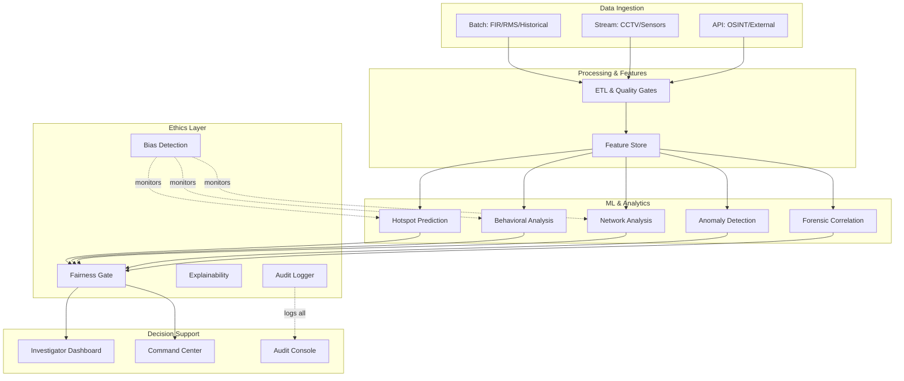

# Walkthrough — AI Crime Intelligence Platform

## What Was Delivered

A **complete, production-grade design** for a government AI-driven criminal intelligence platform — spanning 15 phases from blueprint through national-scale handover. All deliverables are documentation and design artifacts; **no code** was written per the hard constraints.

---

## File Map

| File | Phase | Key Content |
|---|---|---|
| [phase-00-implementation-blueprint.md](./phase-00-implementation-blueprint.md) | **Phase 0** | Master blueprint: vision, requirements, exclusions, 16-week timeline, roles, risk register, success metrics, HITL boundaries |
| [phase-01-system-architecture.md](./phase-01-system-architecture.md) | **Phase 1** | Component diagram, 3-pipeline data flows, zero-trust security, deployment topology, trust boundaries |
| [phase-02-data-ecosystem-governance.md](./phase-02-data-ecosystem-governance.md) | **Phase 2** | 9 data sources, 5 canonical schemas, crime taxonomy, retention policies, access-control matrix |
| [phase-03-ethical-legal-safety.md](./phase-03-ethical-legal-safety.md) | **Phase 3** | Bias metrics, fairness constraints, pre/post-inference ethics gates, 8 red-flag auto-blocks, audit logging |
| [phase-04-feature-engineering.md](./phase-04-feature-engineering.md) | **Phase 4** | 30+ features across 5 dimensions, freshness rules, leakage prevention, feature store architecture |
| [phase-05-crime-pattern-prediction.md](./phase-05-crime-pattern-prediction.md) | **Phase 5** | 4 model types (hotspot, forecast, spike, evolution), walk-forward validation, calibration, asymmetric error costs |
| [phase-06-behavioral-network-analysis.md](./phase-06-behavioral-network-analysis.md) | **Phase 6** | MO clustering (HDBSCAN), crime-series linkage, graph ML (GraphSAGE), risk scoring boundaries |
| [phase-07-real-time-pipeline.md](./phase-07-real-time-pipeline.md) | **Phase 7** | Kafka+Flink streaming, priority scoring formula, latency budgets (≤5s p95), failure modes |
| [phase-08-forensic-correlation.md](./phase-08-forensic-correlation.md) | **Phase 8** | Cross-case similarity, multi-source timeline reconstruction, evidence graphs, inference trails |
| [phase-09-decision-support-interface.md](./phase-09-decision-support-interface.md) | **Phase 9** | ASCII wireframes, "Why this insight?" panels, misuse prevention patterns, accessibility (WCAG 2.1) |
| [phase-10-mlops-governance.md](./phase-10-mlops-governance.md) | **Phase 10** | Model lifecycle FSM, MLflow registry, drift detection (PSI/KS), rollback, 3 incident playbooks |
| [phase-11-security-threat-modeling.md](./phase-11-security-threat-modeling.md) | **Phase 11** | STRIDE threat matrix (17 threats), adversarial ML defenses, 12-point red-team checklist |
| [phase-12-testing-validation.md](./phase-12-testing-validation.md) | **Phase 12** | ~1,000 tests across 9 categories, ML stress tests, UAT scenarios, Go/No-Go criteria |
| [phase-13-pilot-deployment.md](./phase-13-pilot-deployment.md) | **Phase 13** | Shadow-mode 2-week trial, failure analysis taxonomy, improvement backlog template |
| [phase-14-scale-handover.md](./phase-14-scale-handover.md) | **Phase 14** | Pilot → regional → national scaling, federated learning, training curriculum, governance handbook |

---

## Key Design Decisions

| Decision | Rationale |
|---|---|
| **Predict places/times, never people** | Legal compliance; ethical; prevents profiling |
| **Three separate pipelines** (batch/stream/forensic) | Different latency, reliability, and scale needs |
| **Ethics gate on every inference path** | Structural guarantee, not optional check |
| **Interpretable models first** (GBTs > deep learning) | Government auditability > marginal accuracy |
| **Shadow-mode pilot** before any operational use | Prevents feedback loops; enables unbiased evaluation |
| **Federated approach** for national scale | Data sovereignty; raw data never leaves jurisdiction |

---

## Architecture Overview

---

## Success Metrics Summary

| Category | Key Metric | Target |
|---|---|---|
| **Prediction quality** | Hotspot precision@k | ≥ 70% |
| **Fairness** | Geographic disparity ratio | ≤ 3.0 |
| **Real-time** | Alert latency (p95) | < 5 seconds |
| **Availability** | System uptime | 99.9% |
| **User satisfaction** | Investigator rating | ≥ 4/5 |

---

## Next Steps

With all phases documented, the next actions would be:
1. **Stakeholder review** of Phase 0 blueprint and Phase 3 ethics layer
2. **Infrastructure provisioning** per Phase 1 topology
3. **Data onboarding** starting with the highest-quality sources (Phase 2)
4. **Feature engineering + model development** (Phases 4–6)
