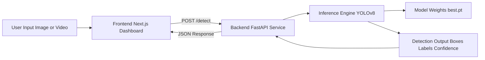

# ThreatScan AI
Real-time threat detection from image and video input using YOLOv8.

## Tech Stack
- Frontend: Next.js 14, React 18, TypeScript, Tailwind CSS
- Backend API: FastAPI, Uvicorn, Pydantic
- AI Model: Ultralytics YOLOv8, PyTorch, OpenCV, NumPy
- Communication: REST API (frontend calls backend at `http://localhost:8000`)

## Project Structure
```text
threat-detection/
├─ frontend/               # Next.js dashboard
├─ backend/                # FastAPI service (detect endpoint)
├─ src/                    # Detection, validation, utilities
├─ models/                 # Base model weights (yolov8n.pt, yolo26n.pt)
├─ runs/detect/train*/     # Trained model outputs
├─ data/                   # Dataset, input media
├─ logs/                   # Event logs, snapshots
├─ train.py                # YOLOv8 training script
├─ verify_install.py       # Python dependency check
└─ requirements.txt        # Model/runtime dependencies
```

## Prerequisites
- Python 3.10+
- Node.js 18+
- npm

## Setup

### 1) Clone Repo
```bash
git clone <your-repo-url>
cd threat-detection
```

### 2) Python Environment (Model + Backend)
```bash
python -m venv venv
```

Windows:
```bash
venv\Scripts\activate
```

macOS/Linux:
```bash
source venv/bin/activate
```

Install dependencies:
```bash
pip install -r requirements.txt
pip install -r backend/requirements.txt
```

Optional verification:
```bash
python verify_install.py
```

### 3) Frontend Setup
```bash
cd frontend
npm install
cd ..
```

## Run (Step by Step)

### 1) Start Backend API
From project root:
```bash
venv\Scripts\activate
cd backend
python main.py
```

Backend runs at `http://localhost:8000`.

### 2) Start Frontend
In a new terminal:
```bash
cd frontend
npm run dev
```

Frontend runs at `http://localhost:3000`.

### 3) Test the App
- Open the frontend in browser
- Upload an image/video
- Frontend sends request to backend `/detect`
- Detection results are displayed in UI

## Features
- Image upload and threat detection
- YOLOv8 inference with confidence and bounding boxes
- FastAPI endpoint for detection and health checks
- Next.js dashboard for live monitoring and alert views

## API Endpoints
- `GET /` - health status
- `GET /health` - health status
- `POST /detect` - image threat detection

## System Flow


## Notes
- This is a prototype implementation focused on fast iteration.
- Model path defaults to `runs/detect/train6/weights/best.pt`.
- For production, add auth, rate limits, logging hardening, and deployment config.

## Setup Checklist
- [ ] Python venv created and activated
- [ ] `requirements.txt` and `backend/requirements.txt` installed
- [ ] `python verify_install.py` passes
- [ ] Backend starts at `http://localhost:8000`
- [ ] Frontend starts at `http://localhost:3000`
- [ ] Upload returns detection result in UI
